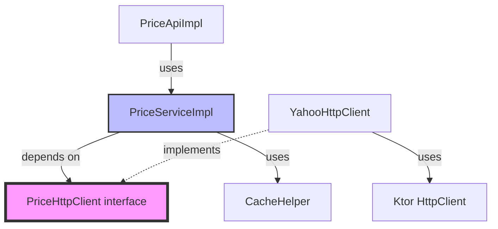

# UFC 아키텍처 문서

> **Version**: 2.0
> **Last Updated**: 2025-12-03
> **Architecture Style**: Clean Architecture with Namespace-based API

---

## 목차

- [개요](#개요)
- [아키텍처 원칙](#아키텍처-원칙)
- [계층 구조](#계층-구조)
- [도메인별 컴포넌트](#도메인별-컴포넌트)
- [의존성 방향](#의존성-방향)
- [데이터 흐름](#데이터-흐름)
- [주요 패턴](#주요-패턴)

---

## 개요

**UFC (Unified Finance Client)** 는 Yahoo Finance와 FRED API를 통합하여 금융 데이터를 제공하는 Kotlin 라이브러리입니다.

### 아키텍처 스타일

UFC는 **클린 아키텍처 (Clean Architecture)** 를 기반으로 설계되었으며, 다음의 특징을 가집니다:

- **계층 분리**: Presentation, Domain, Infrastructure 계층 명확히 분리
- **의존성 역전 (DIP)**: 도메인 계층이 인프라 계층의 인터페이스에만 의존
- **도메인 중심 설계**: 비즈니스 로직이 외부 라이브러리에 독립적
- **테스트 용이성**: 모든 외부 의존성은 Fake 객체로 교체 가능

---

## 아키텍처 원칙

### 1. 단방향 의존성 (Unidirectional Dependency)

의존성은 항상 **외부 → 내부**, **구체 → 추상** 방향으로만 흐릅니다.

```
Infrastructure → Domain ← Presentation
     (구체)      (추상)      (사용)
```

**규칙**:
- Infrastructure 계층은 Domain 계층의 인터페이스를 구현
- Domain 계층은 Infrastructure 계층을 알지 못함
- Presentation 계층은 Domain 계층만 사용

---

### 2. 의존성 역전 (Dependency Inversion Principle)

고수준 모듈(Domain)은 저수준 모듈(Infrastructure)에 의존하지 않고, 둘 다 추상화(Interface)에 의존합니다.

```kotlin
// ✅ 좋은 예: Domain이 인터페이스에 의존
class PriceServiceImpl(
    private val httpClient: PriceHttpClient  // 인터페이스
)

// ❌ 나쁜 예: Domain이 구체 클래스에 의존
class PriceServiceImpl(
    private val httpClient: YahooHttpClient  // 구체 클래스
)
```

---

### 3. 도메인 순수성 (Domain Purity)

도메인 계층은 외부 라이브러리(Ktor, HTTP 등)에 직접 의존하지 않습니다.

```kotlin
// ✅ 좋은 예: Ktor를 직접 import 안 함
package com.ulalax.ufc.domain.price

import com.ulalax.ufc.internal.yahoo.response.PriceResponse  // 내부 Response 타입만

class PriceServiceImpl(
    private val httpClient: PriceHttpClient  // 인터페이스
) {
    // Ktor 의존성 없음
}

// ❌ 나쁜 예: Ktor 직접 의존
package com.ulalax.ufc.domain.price

import io.ktor.client.HttpClient  // 외부 라이브러리 직접 의존

class PriceServiceImpl(
    private val httpClient: HttpClient
)
```

---

### 4. 문맥의 지역성 (Locality of Behavior)

관련 로직은 물리적으로 가까이 배치하여 인지 부하를 줄입니다.

**예시**: 파싱 로직은 Service 내부에 배치

```kotlin
class PriceServiceImpl(...) {

    suspend fun getCurrentPrice(symbol: String): PriceData {
        val response = httpClient.fetchQuoteSummary(symbol)
        return parsePriceData(symbol, response)  // 바로 근처에서 파싱
    }

    // 파싱 로직이 사용되는 곳 근처에 위치
    private fun parsePriceData(symbol: String, response: PriceResponse): PriceData {
        // 파싱 로직
    }
}
```

**대안 (거부됨)**: 별도 Parser 클래스
- Parser 파일과 Service 파일을 오가며 읽어야 함
- 인지 부하 증가

---

### 5. YAGNI (You Aren't Gonna Need It)

현재 필요하지 않은 추상화는 만들지 않습니다.

**예시**:
- ✅ CacheHelper는 구체 클래스만 제공 (인터페이스 없음)
- ❌ Cache 인터페이스는 불필요 (구현체가 하나뿐, 교체 가능성 없음)

```kotlin
// ✅ 좋은 예: 구체 클래스만 제공
class CacheHelper {
    suspend fun <T> getOrPut(...): T
}

// ❌ 나쁜 예: 불필요한 인터페이스
interface CacheProvider {
    suspend fun <T> getOrPut(...): T
}

class InMemoryCacheProvider : CacheProvider {
    // 구현체가 하나뿐
}
```

---

## 계층 구조

UFC는 3개의 주요 계층으로 구성됩니다:

```
┌─────────────────────────────────────────────────────────────┐
│  Presentation Layer (Client/API)                            │
│  - UFC (Facade)                                             │
│  - PriceApi, StockApi, FundsApi, CorpApi, MacroApi          │
│  - 사용자에게 간단하고 일관된 API 제공                         │
└─────────────────────────────────────────────────────────────┘
                            ↓ uses
┌─────────────────────────────────────────────────────────────┐
│  Domain Layer (Service + Interface)                         │
│  - PriceServiceImpl, StockServiceImpl, ...                  │
│  - PriceHttpClient (interface) ⭐                           │
│  - PriceData, OHLCV, CompanyInfo (DTO)                      │
│  - 비즈니스 로직 및 도메인 검증                                │
│  - 외부 의존성 없음 (도메인 순수성)                            │
└─────────────────────────────────────────────────────────────┘
                            ↑ implements
┌─────────────────────────────────────────────────────────────┐
│  Infrastructure Layer (Adapter)                             │
│  - YahooHttpClient (implements PriceHttpClient)             │
│  - FredHttpClient (implements MacroHttpClient)              │
│  - CacheHelper (utility)                                    │
│  - RateLimiter (utility)                                    │
│  - HTTP 통신, 캐싱, Rate Limiting 등 인프라 관심사              │
└─────────────────────────────────────────────────────────────┘
```

---

### Presentation Layer (사용자 인터페이스)

**책임**:
- 사용자에게 간단하고 일관된 API 제공
- 네임스페이스별로 도메인 분리
- 도메인 서비스 위임 (Delegation)

**주요 컴포넌트**:

| 컴포넌트 | 역할 |
|---------|------|
| `UFC` | Facade 패턴. 모든 도메인 API의 진입점 |
| `PriceApi` | 가격 정보 API 인터페이스 |
| `StockApi` | 주식 기본 정보 API 인터페이스 |
| `FundsApi` | 펀드 정보 API 인터페이스 |
| `CorpApi` | 기업 행동 API 인터페이스 |
| `MacroApi` | 거시경제 지표 API 인터페이스 |

**파일 위치**:
```
src/main/kotlin/com/ulalax/ufc/
├── client/
│   ├── UFC.kt                      # Facade
│   ├── UFCClientConfig.kt
│   └── UFCClientImpl.kt            # 실제 구현
└── api/
    ├── PriceApi.kt
    ├── StockApi.kt
    ├── FundsApi.kt
    ├── CorpApi.kt
    └── MacroApi.kt
```

---

### Domain Layer (비즈니스 로직)

**책임**:
- 비즈니스 로직 처리
- 도메인 검증
- HTTP 응답을 도메인 객체로 변환 (파싱)
- 외부 의존성 없음 (도메인 순수성)

**주요 컴포넌트**:

| 컴포넌트 | 역할 | 예시 |
|---------|------|------|
| **Service Interface** | 도메인 기능 정의 | `PriceService` |
| **Service Implementation** | 비즈니스 로직 구현 | `PriceServiceImpl` |
| **HttpClient Interface** | HTTP 통신 추상화 ⭐ | `PriceHttpClient` |
| **DTO (Data Transfer Object)** | 도메인 데이터 모델 | `PriceData`, `OHLCV` |

**파일 위치** (예: Price 도메인):
```
src/main/kotlin/com/ulalax/ufc/domain/price/
├── PriceService.kt              # 서비스 인터페이스
├── PriceServiceImpl.kt          # 서비스 구현체 (비즈니스 로직 + 파싱)
├── PriceHttpClient.kt           # HTTP 클라이언트 인터페이스 ⭐
├── PriceData.kt                 # DTO
├── OHLCV.kt                     # DTO
└── ChartMetadata.kt             # DTO
```

**핵심 원칙**:
- Service는 **HttpClient 인터페이스**에만 의존
- 파싱 로직은 Service 내부에 `private` 메서드로 배치 (문맥의 지역성)
- 외부 라이브러리(Ktor) 직접 의존 금지

---

### Infrastructure Layer (인프라 구현)

**책임**:
- HTTP 통신 (Yahoo Finance, FRED API)
- 캐싱 (인메모리)
- Rate Limiting (Token Bucket 알고리즘)
- Domain Layer의 인터페이스 구현

**주요 컴포넌트**:

| 컴포넌트 | 역할 | 구현 |
|---------|------|------|
| **YahooHttpClient** | Yahoo Finance HTTP 통신 | `PriceHttpClient`, `StockHttpClient` 등 구현 |
| **FredHttpClient** | FRED API HTTP 통신 | `MacroHttpClient` 구현 |
| **CacheHelper** | 인메모리 캐싱 | `ConcurrentHashMap` 기반 |
| **RateLimiter** | 요청 제한 | Token Bucket 알고리즘 |

**파일 위치**:
```
src/main/kotlin/com/ulalax/ufc/
├── infrastructure/
│   ├── yahoo/
│   │   └── YahooHttpClient.kt    # Yahoo Finance HTTP 통신
│   ├── fred/
│   │   └── FredHttpClient.kt     # FRED API HTTP 통신
│   └── ratelimiter/
│       ├── RateLimiter.kt
│       └── TokenBucketRateLimiter.kt
└── util/
    └── CacheHelper.kt             # 캐싱 유틸리티
```

**핵심 원칙**:
- Domain Layer의 인터페이스를 구현
- Ktor, HTTP 등 외부 라이브러리 의존 허용
- 도메인 로직 없음 (HTTP 요청/응답만 처리)

---

## 도메인별 컴포넌트

각 도메인은 동일한 패턴을 따릅니다.

### Price 도메인 (가격 정보)

```
┌─────────────────────────────────────┐
│  Presentation                       │
│  - PriceApi                         │
│  - PriceApiImpl (위임)              │
└─────────────────────────────────────┘
               ↓
┌─────────────────────────────────────┐
│  Domain                             │
│  - PriceService (interface)         │
│  - PriceServiceImpl                 │
│    ├── getCurrentPrice()            │
│    ├── getPriceHistory()            │
│    └── parsePriceData() (private)   │
│  - PriceHttpClient (interface) ⭐   │
│  - PriceData, OHLCV (DTO)           │
└─────────────────────────────────────┘
               ↑
┌─────────────────────────────────────┐
│  Infrastructure                     │
│  - YahooHttpClient                  │
│    ├── implements PriceHttpClient   │
│    └── fetchQuoteSummary()          │
│  - CacheHelper                      │
└─────────────────────────────────────┘
```

**주요 API**:
- `getCurrentPrice(symbol)`: 현재가 조회
- `getPriceHistory(symbol, period, interval)`: 가격 히스토리 조회
- `getPriceHistoryWithMetadata(...)`: 메타데이터 포함 조회

**데이터 모델**:
- `PriceData`: 현재가 정보
- `OHLCV`: 시가/고가/저가/종가/거래량
- `ChartMetadata`: 차트 메타데이터

**캐시 TTL**:
- 현재가: 60초
- 가격 히스토리: 5분

---

### Stock 도메인 (주식 기본 정보)

```
┌─────────────────────────────────────┐
│  Domain                             │
│  - StockService (interface)         │
│  - StockServiceImpl                 │
│    ├── getCompanyInfo()             │
│    ├── getIsin()                    │
│    ├── getFastInfo()                │
│    └── getShares()                  │
│  - StockHttpClient (interface) ⭐   │
│  - CompanyInfo, FastInfo (DTO)      │
└─────────────────────────────────────┘
               ↑
┌─────────────────────────────────────┐
│  Infrastructure                     │
│  - YahooHttpClient                  │
│    └── implements StockHttpClient   │
└─────────────────────────────────────┘
```

**주요 API**:
- `getCompanyInfo(symbol)`: 회사 정보 조회
- `getIsin(symbol)`: ISIN 코드 조회
- `getFastInfo(symbol)`: 빠른 정보 조회
- `getShares(symbol)`: 발행주식수 조회

**데이터 모델**:
- `CompanyInfo`: 회사 정보 (이름, 섹터, 산업 등)
- `FastInfo`: 빠른 정보 (심볼, 거래소, 통화 등)

**캐시 TTL**:
- 회사 정보: 1시간
- ISIN: 1시간
- FastInfo: 60초
- 발행주식수: 1시간

---

### Funds 도메인 (펀드 정보)

```
┌─────────────────────────────────────┐
│  Domain                             │
│  - FundsService (interface)         │
│  - FundsServiceImpl                 │
│    ├── getFundData()                │
│    └── isFund()                     │
│  - FundsHttpClient (interface) ⭐   │
│  - FundData, Holding (DTO)          │
└─────────────────────────────────────┘
               ↑
┌─────────────────────────────────────┐
│  Infrastructure                     │
│  - YahooHttpClient                  │
│    └── implements FundsHttpClient   │
└─────────────────────────────────────┘
```

**주요 API**:
- `getFundData(symbol)`: 펀드 구성 정보 조회
- `isFund(symbol)`: 펀드 여부 확인

**데이터 모델**:
- `FundData`: 펀드 정보 (보유 종목, 자산 배분, 섹터별 비중 등)
- `Holding`: 보유 종목

**캐시 TTL**: 1시간

---

### Corp 도메인 (기업 행동)

```
┌─────────────────────────────────────┐
│  Domain                             │
│  - CorpService (interface)          │
│  - CorpServiceImpl                  │
│    ├── getDividends()               │
│    ├── getSplits()                  │
│    └── getCapitalGains()            │
│  - CorpHttpClient (interface) ⭐    │
│  - DividendData, SplitData (DTO)    │
└─────────────────────────────────────┘
               ↑
┌─────────────────────────────────────┐
│  Infrastructure                     │
│  - YahooHttpClient                  │
│    └── implements CorpHttpClient    │
└─────────────────────────────────────┘
```

**주요 API**:
- `getDividends(symbol, period)`: 배당금 히스토리 조회
- `getSplits(symbol, period)`: 주식분할 히스토리 조회
- `getCapitalGains(symbol, period)`: 자본이득 히스토리 조회

**데이터 모델**:
- `DividendData`: 배당금 정보
- `SplitData`: 주식분할 정보
- `CapitalGainData`: 자본이득 정보

**캐시 TTL**: 1시간

---

### Macro 도메인 (거시경제 지표)

```
┌─────────────────────────────────────┐
│  Domain                             │
│  - MacroService (interface)         │
│  - MacroServiceImpl                 │
│    ├── getGDP()                     │
│    ├── getUnemploymentRate()        │
│    ├── getCPI()                     │
│    └── getSeries()                  │
│  - MacroHttpClient (interface) ⭐   │
│  - MacroSeries (DTO)                │
└─────────────────────────────────────┘
               ↑
┌─────────────────────────────────────┐
│  Infrastructure                     │
│  - FredHttpClient                   │
│    └── implements MacroHttpClient   │
└─────────────────────────────────────┘
```

**주요 API**:
- `getGDP()`: GDP 조회
- `getUnemploymentRate()`: 실업률 조회
- `getCPI()`: 소비자물가지수 조회
- `getSeries(seriesId, ...)`: 커스텀 FRED Series 조회

**데이터 모델**:
- `MacroSeries`: 시계열 데이터
- `MacroObservation`: 관측값

**캐시 TTL**: 1시간

---

## 의존성 방향

### 계층 간 의존성

```
┌────────────────────┐
│   Presentation     │
│   (UFC, *Api)      │
└────────────────────┘
         │
         │ uses
         ↓
┌────────────────────┐
│   Domain           │
│   (*ServiceImpl)   │
└────────────────────┘
         ↑
         │ implements
         │
┌────────────────────┐
│   Infrastructure   │
│   (Yahoo/FredHttp) │
└────────────────────┘
```

**규칙**:
1. Presentation → Domain: 사용 (Dependency)
2. Infrastructure → Domain: 구현 (Implements Interface)
3. Domain ← Infrastructure: **의존하지 않음** (의존성 역전)

---

### 컴포넌트 간 의존성 (Price 도메인 예시)



**핵심 포인트**:
- `PriceServiceImpl`은 `PriceHttpClient` **인터페이스**에만 의존
- `YahooHttpClient`는 `PriceHttpClient`를 **구현** (점선)
- 도메인 계층(`PriceServiceImpl`)은 인프라 계층(`YahooHttpClient`)을 **알지 못함**

---

## 데이터 흐름

### 일반적인 API 호출 흐름

```
사용자
  │
  │ 1. API 호출
  ↓
UFC (Facade)
  │
  │ 2. 도메인 API 위임
  ↓
PriceApiImpl
  │
  │ 3. 서비스 호출
  ↓
PriceServiceImpl
  │
  │ 4. 캐시 확인
  ↓
CacheHelper
  │
  │ 5. 캐시 미스 시
  ↓
PriceHttpClient (interface)
  │
  │ 6. 구현체로 위임
  ↓
YahooHttpClient
  │
  │ 7. HTTP 요청
  ↓
Yahoo Finance API
  │
  │ 8. JSON 응답
  ↓
YahooHttpClient
  │
  │ 9. Response 객체 반환
  ↓
PriceServiceImpl
  │
  │ 10. JSON 파싱
  │     (parsePriceData)
  ↓
PriceData (DTO)
  │
  │ 11. 캐시에 저장
  ↓
CacheHelper
  │
  │ 12. 결과 반환
  ↓
사용자
```

**단계별 설명**:

1. 사용자가 `ufc.price.getCurrentPrice("AAPL")` 호출
2. `UFC` Facade가 `PriceApiImpl`로 위임
3. `PriceApiImpl`이 `PriceServiceImpl.getCurrentPrice()` 호출
4. `PriceServiceImpl`이 먼저 캐시 확인 (`CacheHelper.getOrPut`)
5. 캐시 미스 시 `PriceHttpClient.fetchQuoteSummary()` 호출
6. 런타임에 `YahooHttpClient` 구현체로 위임 (의존성 주입)
7. `YahooHttpClient`가 Ktor를 사용하여 Yahoo Finance API 호출
8. Yahoo Finance API가 JSON 응답 반환
9. `YahooHttpClient`가 `PriceResponse` 객체로 역직렬화하여 반환
10. `PriceServiceImpl`이 `parsePriceData()`로 `PriceData` 변환
11. 변환된 데이터를 캐시에 저장
12. 사용자에게 `PriceData` 반환

---

### 캐시 히트 시 흐름

```
사용자
  │
  │ 1. API 호출 (60초 이내)
  ↓
UFC → PriceApiImpl → PriceServiceImpl
  │
  │ 2. 캐시 확인
  ↓
CacheHelper
  │
  │ 3. 캐시 히트 (TTL 유효)
  │
  │ 4. 캐시된 데이터 반환
  ↓
사용자

(HTTP 호출 없음 - 빠름!)
```

---

### 에러 처리 흐름

```
사용자
  │
  │ 1. 잘못된 심볼로 API 호출
  ↓
PriceServiceImpl
  │
  │ 2. 도메인 검증 실패
  │
  │ 3. UfcException 발생
  ↓
사용자
  │
  │ 4. ErrorCode로 에러 처리
```

**예시**:
```kotlin
try {
    val price = ufc.price.getCurrentPrice("INVALID")
} catch (e: UfcException) {
    when (e.errorCode) {
        ErrorCode.INVALID_SYMBOL -> println("Invalid symbol")
        ErrorCode.PRICE_DATA_NOT_FOUND -> println("Price not found")
        else -> println("Unknown error")
    }
}
```

---

## 주요 패턴

### 1. Facade 패턴

**구현**: `UFC` 클래스

```kotlin
class UFC {
    val price: PriceApi
    val stock: StockApi
    val funds: FundsApi
    val corp: CorpApi
    val macro: MacroApi?
}
```

**목적**:
- 복잡한 내부 구조를 간단한 인터페이스로 제공
- 사용자는 `UFC` 하나만 알면 됨

---

### 2. Dependency Injection (수동 DI)

**구현**: `UFCClientImpl`

```kotlin
internal class UFCClientImpl(config: UFCClientConfig) {

    // 공유 인프라
    private val httpClient = YahooHttpClientFactory.create(config)
    private val rateLimiter = TokenBucketRateLimiter("YAHOO", config.rateLimitConfig)
    private val cache = CacheHelper()

    // Price 도메인 의존성 주입
    private val priceHttpClient: PriceHttpClient = YahooHttpClient(httpClient, rateLimiter)
    private val priceService = PriceServiceImpl(priceHttpClient, cache)
    val price: PriceApi = PriceApiImpl(priceService)

    // 다른 도메인도 동일 패턴...
}
```

**장점**:
- 테스트 시 Fake 구현체로 교체 가능
- 의존성 명확히 표현

---

### 3. Interface Segregation

각 도메인마다 전용 HttpClient 인터페이스 제공:

```kotlin
// Price 전용
interface PriceHttpClient {
    suspend fun fetchQuoteSummary(...): PriceResponse
    suspend fun fetchChart(...): ChartResponse
}

// Stock 전용
interface StockHttpClient {
    suspend fun fetchQuoteSummary(...): QuoteSummaryResponse
}

// Funds 전용
interface FundsHttpClient {
    suspend fun fetchFundData(...): FundResponse
}
```

**장점**:
- 각 도메인이 필요한 메서드만 노출
- 인터페이스가 비대해지지 않음

---

### 4. Template Method (파싱 로직)

**구현**: Service 내부의 `private` 파싱 메서드

```kotlin
class PriceServiceImpl(...) {

    // Public 메서드: 템플릿
    override suspend fun getCurrentPrice(symbol: String): PriceData {
        validateSymbol(symbol)

        return cache.getOrPut("price:current:$symbol", ttl = 60.seconds) {
            val response = httpClient.fetchQuoteSummary(symbol)
            parsePriceData(symbol, response)  // 파싱 위임
        }
    }

    // Private 메서드: 구체 구현
    private fun parsePriceData(symbol: String, response: PriceResponse): PriceData {
        // JSON → DTO 변환 로직
    }
}
```

**장점**:
- 공통 흐름(캐시 → HTTP → 파싱)은 public 메서드에
- 구체 파싱 로직은 private 메서드에
- 문맥의 지역성 유지

---

### 5. Namespace Pattern

**구현**: 도메인별 API 네임스페이스

```kotlin
// ✅ 네임스페이스로 도메인 분리
ufc.price.getCurrentPrice("AAPL")      // Price 도메인
ufc.stock.getCompanyInfo("AAPL")       // Stock 도메인
ufc.funds.getFundData("SPY")           // Funds 도메인
ufc.corp.getDividends("AAPL", period)  // Corp 도메인
ufc.macro.getGDP()                     // Macro 도메인

// ❌ 평면화된 API (Before)
ufc.getCurrentPrice("AAPL")
ufc.getCompanyInfo("AAPL")
```

**장점**:
- 명확한 도메인 분리
- IDE 자동완성 향상
- 확장성 (새 도메인 추가 용이)

---

## 테스트 아키텍처

### Unit Test 구조

```
src/test/kotlin/
├── domain/
│   └── price/
│       └── PriceServiceImplTest.kt      # Service 단위 테스트
├── fakes/
│   ├── FakePriceHttpClient.kt           # Fake 구현체
│   ├── FakeStockHttpClient.kt
│   └── ...
└── utils/
    └── UnitTestBase.kt                  # 테스트 베이스
```

**예시**:
```kotlin
class PriceServiceImplTest {

    @Test
    fun `getCurrentPrice - 정상 조회`() = runTest {
        // Given: Fake 구현체 사용
        val fakeHttpClient = FakePriceHttpClient()
        fakeHttpClient.setResponse("AAPL", validResponse)

        val service = PriceServiceImpl(fakeHttpClient, CacheHelper())

        // When
        val price = service.getCurrentPrice("AAPL")

        // Then: 상태 검증 (Classical TDD)
        assertThat(price.symbol).isEqualTo("AAPL")
        assertThat(price.lastPrice).isEqualTo(150.0)
    }
}
```

**핵심**:
- Fake 구현체로 외부 의존성 제거
- 상태 검증 (assert state, not verify call)
- 빠른 실행 (< 100ms)

---

## 관련 문서

- [API 사용 가이드](./API_USAGE_GUIDE.md) - 도메인별 API 사용법
- [ADR-001: 클린 아키텍처 리팩토링](./adr/ADR-001-clean-architecture-refactoring.md) - 아키텍처 결정 배경
- [마이그레이션 가이드](./MIGRATION_GUIDE_V2.md) - V1에서 V2로 마이그레이션
- [테스트 원칙](./test-principle.md) - Classical TDD 및 Fake 패턴

---

**최종 수정일**: 2025-12-03
**버전**: 2.0
