# UFC API 네임스페이스 체계

## 1. 개요

UFC (Unified Finance Client)는 yfinance를 Kotlin/JVM 환경에서 사용하기 위한 래퍼 라이브러리로, 기능별로 명확히 분리된 네임스페이스 아키텍처를 채택합니다.

### 설계 원칙

1. **단일 책임 원칙**: 각 네임스페이스는 하나의 명확한 도메인만 담당
2. **기능 중복 금지**: 네임스페이스 간 기능 중복 없음
3. **yfinance 기반**: yfinance가 제공하는 기능만 명세화
4. **확장성**: 향후 새로운 데이터 소스 추가 가능한 구조 (KRX, Bloomberg 등)

### 경계 케이스 정의

동일 데이터가 여러 네임스페이스에 걸쳐 있을 수 있는 경우, 아래 기준으로 명확히 구분합니다:

| 데이터 | 담당 네임스페이스 | 이유 |
|-------|----------------|------|
| **earnings (실적)** | `ufc.calendar` - 발표일, 실제 EPS/매출<br>`ufc.analyst` - 추정치, 트렌드, 수정치 | 실제 발생 이벤트 vs 예측 정보 분리 |
| **marketCap (시가총액)** | `ufc.price` | 주가 × 발행주식수로 실시간 변동하는 가격 파생 데이터 |
| **sharesOutstanding (발행주식수)** | `ufc.stock` | 회사 기본 정보 (자주 변경되지 않음) |
| **dividendRate/Yield** | `ufc.price` - 현재 수익률<br>`ufc.corp` - 배당 히스토리 | 현재 지표 vs 과거 이력 분리 |
| **52weekHigh/Low** | `ufc.price` | 가격 기반 통계 지표 |

### 설계 결정 사항

#### 1. 네이밍 선택: `ufc.corp` vs `ufc.actions`

| 후보 | 장점 | 단점 |
|-----|------|------|
| `ufc.corp` | 기업 이벤트 전체 포괄, KRX 확장 시 호환 | "회사 정보"와 혼동 가능 |
| `ufc.actions` | 명확한 의미 (corporate actions) | 영어권 전용 용어 |

**결정**: `ufc.corp` 유지
- 이유: KRX 등 다른 시장 확장 시 "기업 공시/이벤트" 전반을 담을 수 있는 포괄적 이름

#### 2. 크기 불균형 허용

| 네임스페이스 | 메서드 수 | 처리 방식 |
|------------|---------|----------|
| `ufc.analyst` | 10개 | 유지 (모두 애널리스트 도메인) |
| `ufc.esg` | 1개 | **별도 유지** |

**ufc.esg 별도 유지 이유**:
- ESG는 독립적인 도메인 (환경, 사회, 지배구조)
- 향후 ESG 데이터 소스 확장 가능 (한국기업지배구조원, MSCI ESG 등)
- `ufc.stock`에 포함 시 도메인 경계 모호해짐

---

## 2. 전체 네임스페이스 목록

| 네임스페이스 | 목적 | 상태 | Yahoo API 엔드포인트 |
|------------|------|------|---------------------|
| **ufc.price** | 가격 정보 (현재가, 히스토리) | ✅ 명세 완료 | `/v10/finance/quoteSummary`<br>`/v8/finance/chart` |
| **ufc.funds** | 펀드 구성 정보 (ETF/뮤추얼펀드) | ✅ 명세 완료 | `/v10/finance/quoteSummary` (fundProfile, topHoldings) |
| **ufc.corp** | 기업 이벤트 (배당, 분할, 자본이득) | ✅ 명세 완료 | `/v8/finance/chart` (events) |
| **ufc.macro** | 매크로 경제 지표 | ✅ 기존 | FRED API |
| **ufc.stock** | 기본 회사 정보 | 🔄 수정 필요 | `/v10/finance/quoteSummary` (assetProfile, summaryProfile) |
| **ufc.financials** | 재무제표 | 📝 명세 예정 | `/v10/finance/quoteSummary` (financialData, incomeStatementHistory, etc.) |
| **ufc.holders** | 주주 정보 | 📝 명세 예정 | `/v10/finance/quoteSummary` (majorHoldersBreakdown, institutionOwnership, etc.) |
| **ufc.analyst** | 애널리스트 정보 | 📝 명세 예정 | `/v10/finance/quoteSummary` (recommendationTrend, earningsEstimate, etc.) |
| **ufc.news** | 뉴스 및 공시 | 📝 명세 예정 | `/v1/finance/search`<br>`/v2/news/v2/list` |
| **ufc.calendar** | 이벤트 캘린더 | 📝 명세 예정 | `/v1/finance/options/{symbol}`<br>`/v10/finance/quoteSummary` (calendarEvents) |
| **ufc.options** | 옵션 정보 | 📝 명세 예정 | `/v7/finance/options/{symbol}` |
| **ufc.esg** | ESG 정보 | 📝 명세 예정 | `/v10/finance/quoteSummary` (esgScores) |
| **ufc.search** | 심볼 검색 | 📝 명세 예정 | `/v1/finance/search` |

---

## 3. 네임스페이스 상세

### 3.1. ufc.price (가격 정보) ✅

**목적**: 현재 가격 및 가격 히스토리 조회

**담당 기능**:
- 현재 가격 정보 (실시간/장중 가격, 거래량, 시가총액)
- 가격 히스토리 (OHLCV, 조정종가)
- 52주 고가/저가, 이동평균

**yfinance 메서드**:
- `Ticker.get_info()` → price 관련 필드만
- `Ticker.history()` → OHLCV 데이터

**Yahoo API 엔드포인트**:
- `/v10/finance/quoteSummary?modules=price,summaryDetail`
- `/v8/finance/chart/{symbol}?period={period}&interval={interval}`

**주요 데이터 모델**:
- `PriceData`: lastPrice, open, high, low, volume, marketCap, fiftyTwoWeekHigh/Low, fiftyDayAverage, twoHundredDayAverage
- `OHLCV`: timestamp, open, high, low, close, adjClose, volume
- `ChartMetadata`: currency, timezone, exchangeName

**API 인터페이스**:
```kotlin
interface PriceApi {
    suspend fun getCurrentPrice(symbol: String): PriceData
    suspend fun getCurrentPrice(symbols: List<String>): Map<String, PriceData>
    suspend fun getPriceHistory(symbol: String, period: String?, interval: String, start: LocalDate?, end: LocalDate?): List<OHLCV>
    suspend fun getRawPrice(symbol: String): PriceResponse
}
```

**TTL 캐싱**: 1분 (실시간 데이터)

**자산 유형 지원**:
- Stock: ✅
- ETF: ✅
- MutualFund: ✅

---

### 3.2. ufc.funds (펀드 구성) ✅

**목적**: ETF 및 뮤추얼펀드 포트폴리오 구성 정보

**담당 기능**:
- Top Holdings (상위 보유 종목)
- Asset Classes (자산군별 배분)
- Sector Weightings (섹터별 비중)
- Bond Ratings, Bond Holdings (채권 정보)

**yfinance 메서드**:
- `Ticker.get_funds_data()` → `FundsData` 객체 반환

**Yahoo API 엔드포인트**:
- `/v10/finance/quoteSummary?modules=fundProfile,topHoldings`

**주요 데이터 모델**:
- `TopHoldings`: symbol, name, holdingPercent
- `AssetClasses`: cash, stocks, bonds, other, preferredStocks, convertibleBonds
- `SectorWeightings`: sectorName, weightingPercent
- `BondRatings`: rating (AAA, AA, A, BBB, BB, B, Below B, Not Rated)

**API 인터페이스**:
```kotlin
interface FundsApi {
    suspend fun getFundsData(symbol: String): FundsData
    suspend fun getFundsData(symbols: List<String>): Map<String, FundsData>
    suspend fun getRawFundsData(symbol: String): FundsResponse
}
```

**TTL 캐싱**: 24시간 (일일 업데이트)

**자산 유형 지원**:
- Stock: ❌
- ETF: ✅
- MutualFund: ✅

---

### 3.3. ufc.corp (기업 이벤트) ✅

**목적**: 배당금, 주식분할, 자본이득 등 기업 이벤트

**담당 기능**:
- 배당금 히스토리 (Dividends)
- 주식분할 히스토리 (Stock Splits)
- 자본이득 히스토리 (Capital Gains)
- 통합 조회 (Actions)

**yfinance 메서드**:
- `Ticker.get_dividends()`
- `Ticker.get_splits()`
- `Ticker.get_capital_gains()`
- `Ticker.get_actions()`

**Yahoo API 엔드포인트**:
- `/v8/finance/chart/{symbol}?events=div,split,capitalGains`

**주요 데이터 모델**:
- `Dividend`: date, amount
- `StockSplit`: date, splitRatio (예: "2:1")
- `CapitalGain`: date, amount
- `CorporateActions`: dividends, splits, capitalGains 통합

**API 인터페이스**:
```kotlin
interface CorporateActionsApi {
    suspend fun getDividends(symbol: String, start: LocalDate?, end: LocalDate?): List<Dividend>
    suspend fun getStockSplits(symbol: String, start: LocalDate?, end: LocalDate?): List<StockSplit>
    suspend fun getCapitalGains(symbol: String, start: LocalDate?, end: LocalDate?): List<CapitalGain>
    suspend fun getActions(symbol: String, start: LocalDate?, end: LocalDate?): CorporateActions
}
```

**TTL 캐싱**: 24시간 (일일 업데이트)

**자산 유형 지원**:
- Stock: ✅ (배당, 분할, 자본이득)
- ETF: ⚠️ (배당만, 분할 거의 없음)
- MutualFund: ✅ (배당, 자본이득), ❌ (분할 없음)

---

### 3.4. ufc.macro (매크로 지표) ✅

**목적**: FRED 매크로 경제 지표

**담당 기능**:
- GDP, 실업률, 인플레이션, 금리 등 경제 지표 조회

**데이터 소스**: FRED (Federal Reserve Economic Data) API

**주요 데이터 모델**:
- `MacroIndicator`: date, value, seriesId

**TTL 캐싱**: 24시간

**자산 유형 지원**: N/A (경제 지표)

---

### 3.5. ufc.stock (기본 회사 정보) 🔄

**목적**: 개별 주식의 기본 정보 (회사명, 섹터, 산업, 국가 등)

**담당 기능**:
- 회사 기본 정보 (Company Info)
- 빠른 정보 조회 (Fast Info)
- ISIN 코드

**yfinance 메서드**:
- `Ticker.get_info()` → 회사 기본 정보만 (address, industry, sector, website, employees 등)
- `Ticker.get_fast_info()` → 빠른 조회용 (currency, exchange, quoteType, symbol)
- `Ticker.get_isin()` → ISIN 코드

**Yahoo API 엔드포인트**:
- `/v10/finance/quoteSummary?modules=assetProfile,summaryProfile`

**주요 데이터 모델**:
- `CompanyInfo`: longName, shortName, sector, industry, country, city, website, employees, longBusinessSummary
- `FastInfo`: currency, exchange, quoteType, symbol
- `Isin`: isin 코드

**API 인터페이스**:
```kotlin
interface StockApi {
    suspend fun getInfo(symbol: String): CompanyInfo
    suspend fun getFastInfo(symbol: String): FastInfo
    suspend fun getIsin(symbol: String): String
}
```

**TTL 캐싱**: 24시간 (기본 정보는 자주 변경되지 않음)

**자산 유형 지원**:
- Stock: ✅
- ETF: ⚠️ (제한적 정보)
- MutualFund: ⚠️ (제한적 정보)

---

### 3.6. ufc.financials (재무제표) 📝

**목적**: 손익계산서, 대차대조표, 현금흐름표

**담당 기능**:
- 손익계산서 (Income Statement) - 연간/분기/TTM
- 대차대조표 (Balance Sheet) - 연간/분기
- 현금흐름표 (Cash Flow Statement) - 연간/분기/TTM
- 실적 정보 (Earnings) - 연간/분기

**yfinance 메서드**:
- `Ticker.get_income_stmt(freq='yearly'|'quarterly'|'trailing')` → pretty=True/False
- `Ticker.get_balance_sheet(freq='yearly'|'quarterly')` → pretty=True/False
- `Ticker.get_cash_flow(freq='yearly'|'quarterly'|'trailing')` → pretty=True/False
- `Ticker.get_earnings(freq='yearly'|'quarterly')`

**Yahoo API 엔드포인트**:
- `/v10/finance/quoteSummary?modules=incomeStatementHistory,incomeStatementHistoryQuarterly`
- `/v10/finance/quoteSummary?modules=balanceSheetHistory,balanceSheetHistoryQuarterly`
- `/v10/finance/quoteSummary?modules=cashflowStatementHistory,cashflowStatementHistoryQuarterly`
- `/v10/finance/quoteSummary?modules=earnings,earningsHistory`

**주요 데이터 모델**:
- `IncomeStatement`: totalRevenue, costOfRevenue, grossProfit, operatingIncome, netIncome, eps
- `BalanceSheet`: totalAssets, totalLiabilities, stockholdersEquity, cash, totalDebt
- `CashFlow`: operatingCashFlow, investingCashFlow, financingCashFlow, freeCashFlow
- `Earnings`: revenue, earnings (실제 vs 추정치)

**API 인터페이스**:
```kotlin
interface FinancialsApi {
    suspend fun getIncomeStatement(symbol: String, freq: Frequency): DataFrame
    suspend fun getBalanceSheet(symbol: String, freq: Frequency): DataFrame
    suspend fun getCashFlow(symbol: String, freq: Frequency): DataFrame
    suspend fun getEarnings(symbol: String, freq: Frequency): DataFrame
}

enum class Frequency { YEARLY, QUARTERLY, TRAILING }
```

**TTL 캐싱**: 24시간 (분기별 업데이트)

**자산 유형 지원**:
- Stock: ✅
- ETF: ❌
- MutualFund: ❌

---

### 3.7. ufc.holders (주주 정보) 📝

**목적**: 주주 구조, 내부자 거래 정보

**담당 기능**:
- 주요 주주 분포 (Major Holders)
- 기관 투자자 보유 현황 (Institutional Holders)
- 뮤추얼펀드 보유 현황 (Mutual Fund Holders)
- 내부자 거래 (Insider Purchases, Transactions)
- 내부자 명부 (Insider Roster)

**yfinance 메서드**:
- `Ticker.get_major_holders()`
- `Ticker.get_institutional_holders()`
- `Ticker.get_mutualfund_holders()`
- `Ticker.get_insider_purchases()`
- `Ticker.get_insider_transactions()`
- `Ticker.get_insider_roster_holders()`

**Yahoo API 엔드포인트**:
- `/v10/finance/quoteSummary?modules=majorHoldersBreakdown`
- `/v10/finance/quoteSummary?modules=institutionOwnership`
- `/v10/finance/quoteSummary?modules=fundOwnership`
- `/v10/finance/quoteSummary?modules=insiderHolders,insiderTransactions,netSharePurchaseActivity`

**주요 데이터 모델**:
- `MajorHolders`: insidersPercentHeld, institutionsPercentHeld, floatPercentHeld
- `InstitutionalHolder`: organization, shares, value, percentHeld, reportDate
- `MutualFundHolder`: organization, shares, value, percentHeld, reportDate
- `InsiderTransaction`: insider, position, transactionType, shares, value, date

**API 인터페이스**:
```kotlin
interface HoldersApi {
    suspend fun getMajorHolders(symbol: String): MajorHolders
    suspend fun getInstitutionalHolders(symbol: String): List<InstitutionalHolder>
    suspend fun getMutualFundHolders(symbol: String): List<MutualFundHolder>
    suspend fun getInsiderPurchases(symbol: String): List<InsiderTransaction>
    suspend fun getInsiderTransactions(symbol: String): List<InsiderTransaction>
    suspend fun getInsiderRoster(symbol: String): List<InsiderRoster>
}
```

**TTL 캐싱**: 24시간 (분기별 업데이트)

**자산 유형 지원**:
- Stock: ✅
- ETF: ❌
- MutualFund: ❌

---

### 3.8. ufc.analyst (애널리스트 정보) 📝

**목적**: 애널리스트 추천, 목표가, 실적 추정치

**담당 기능**:
- 추천 등급 (Recommendations, Upgrades/Downgrades)
- 추천 등급 요약 (Recommendation Summary)
- 목표가 (Analyst Price Targets)
- 실적 추정치 (Earnings Estimate, Revenue Estimate)
- 실적 히스토리 (Earnings History)
- EPS 트렌드 및 수정치 (EPS Trend, EPS Revisions)
- 성장 추정치 (Growth Estimates)

**yfinance 메서드**:
- `Ticker.get_recommendations()`
- `Ticker.get_recommendations_summary()`
- `Ticker.get_upgrades_downgrades()`
- `Ticker.get_analyst_price_targets()`
- `Ticker.get_earnings_estimate()`
- `Ticker.get_revenue_estimate()`
- `Ticker.get_earnings_history()`
- `Ticker.get_eps_trend()`
- `Ticker.get_eps_revisions()`
- `Ticker.get_growth_estimates()`

**Yahoo API 엔드포인트**:
- `/v10/finance/quoteSummary?modules=recommendationTrend,upgradeDowngradeHistory`
- `/v10/finance/quoteSummary?modules=financialData` (targetHighPrice, targetLowPrice, targetMeanPrice)
- `/v10/finance/quoteSummary?modules=earningsTrend,earningsHistory`

**주요 데이터 모델**:
- `Recommendation`: firm, toGrade, fromGrade, action, date
- `RecommendationSummary`: strongBuy, buy, hold, sell, strongSell
- `AnalystPriceTarget`: targetHigh, targetLow, targetMean, targetMedian, numberOfAnalysts
- `EarningsEstimate`: avg, low, high, yearAgoEps, numberOfAnalysts, growth

**API 인터페이스**:
```kotlin
interface AnalystApi {
    suspend fun getRecommendations(symbol: String): List<Recommendation>
    suspend fun getRecommendationSummary(symbol: String): RecommendationSummary
    suspend fun getUpgradesDowngrades(symbol: String): List<Recommendation>
    suspend fun getAnalystPriceTargets(symbol: String): AnalystPriceTarget
    suspend fun getEarningsEstimate(symbol: String): DataFrame
    suspend fun getRevenueEstimate(symbol: String): DataFrame
    suspend fun getEarningsHistory(symbol: String): DataFrame
    suspend fun getEpsTrend(symbol: String): DataFrame
    suspend fun getEpsRevisions(symbol: String): DataFrame
    suspend fun getGrowthEstimates(symbol: String): DataFrame
}
```

**TTL 캐싱**: 24시간 (일일 업데이트)

**자산 유형 지원**:
- Stock: ✅
- ETF: ❌
- MutualFund: ❌

---

### 3.9. ufc.news (뉴스 및 공시) 📝

**목적**: 뉴스 기사, SEC 공시 문서

**담당 기능**:
- 뉴스 기사 (News)
- SEC 공시 문서 (SEC Filings)

**yfinance 메서드**:
- `Ticker.get_news()`
- `Ticker.get_sec_filings()`

**Yahoo API 엔드포인트**:
- `/v1/finance/search?q={symbol}&newsCount=10`
- `/v2/news/v2/list?symbols={symbol}`
- SEC API (간접 조회)

**주요 데이터 모델**:
- `NewsArticle`: uuid, title, publisher, link, publishedAt, thumbnail
- `SecFiling`: type (10-K, 10-Q, 8-K, etc.), date, title, edgarUrl

**API 인터페이스**:
```kotlin
interface NewsApi {
    suspend fun getNews(symbol: String, limit: Int = 10): List<NewsArticle>
    suspend fun getSecFilings(symbol: String): List<SecFiling>
}
```

**TTL 캐싱**: 1시간 (뉴스는 자주 업데이트)

**자산 유형 지원**:
- Stock: ✅
- ETF: ✅ (뉴스만)
- MutualFund: ✅ (뉴스만)

---

### 3.10. ufc.calendar (이벤트 캘린더) 📝

**목적**: 실적 발표일, 배당락일, 이벤트 일정

**담당 기능**:
- 캘린더 이벤트 (Calendar Events)
- 실적 발표일 (Earnings Dates)

**yfinance 메서드**:
- `Ticker.get_calendar()` → earnings, revenue, dividends
- `Ticker.get_earnings_dates(limit=12)`

**Yahoo API 엔드포인트**:
- `/v10/finance/quoteSummary?modules=calendarEvents`
- `/v1/finance/options/{symbol}` → earnings 날짜

**주요 데이터 모델**:
- `Calendar`: earnings (date, epsEstimate, epsActual), dividends (exDividendDate, dividendRate)
- `EarningsDate`: date, epsEstimate, epsActual, surprisePercent

**API 인터페이스**:
```kotlin
interface CalendarApi {
    suspend fun getCalendar(symbol: String): Calendar
    suspend fun getEarningsDates(symbol: String, limit: Int = 12): List<EarningsDate>
}
```

**TTL 캐싱**: 24시간 (일일 업데이트)

**자산 유형 지원**:
- Stock: ✅
- ETF: ⚠️ (배당만)
- MutualFund: ⚠️ (배당만)

---

### 3.11. ufc.options (옵션 정보) 📝

**목적**: 옵션 체인, 만기일 정보

**담당 기능**:
- 옵션 만기일 목록 (Options Expiration Dates)
- 옵션 체인 (Option Chain - Calls/Puts)

**yfinance 메서드**:
- `Ticker.options` → 만기일 목록 (property)
- `Ticker.option_chain(date)` → calls, puts, underlying

**Yahoo API 엔드포인트**:
- `/v7/finance/options/{symbol}`
- `/v7/finance/options/{symbol}?date={timestamp}`

**주요 데이터 모델**:
- `OptionExpiration`: expirationDates (List<String>)
- `OptionContract`: contractSymbol, strike, lastPrice, bid, ask, volume, openInterest, impliedVolatility, inTheMoney
- `OptionChain`: calls (List<OptionContract>), puts (List<OptionContract>), underlying (price info)

**API 인터페이스**:
```kotlin
interface OptionsApi {
    suspend fun getExpirationDates(symbol: String): List<String>
    suspend fun getOptionChain(symbol: String, date: String?): OptionChain
}
```

**TTL 캐싱**: 5분 (옵션은 실시간성 중요)

**자산 유형 지원**:
- Stock: ✅
- ETF: ✅
- MutualFund: ❌

---

### 3.12. ufc.esg (ESG 정보) 📝

**목적**: 지속가능성 및 ESG 점수

**담당 기능**:
- ESG 점수 (Environment, Social, Governance)
- 지속가능성 정보 (Sustainability)

**yfinance 메서드**:
- `Ticker.get_sustainability()`

**Yahoo API 엔드포인트**:
- `/v10/finance/quoteSummary?modules=esgScores`

**주요 데이터 모델**:
- `Sustainability`: totalEsg, environmentScore, socialScore, governanceScore, esgPerformance, highestControversy

**API 인터페이스**:
```kotlin
interface EsgApi {
    suspend fun getSustainability(symbol: String): Sustainability
}
```

**TTL 캐싱**: 7일 (ESG 점수는 분기/연간 업데이트)

**자산 유형 지원**:
- Stock: ✅
- ETF: ❌
- MutualFund: ❌

---

### 3.13. ufc.search (심볼 검색) 📝

**목적**: 티커 심볼 검색

**담당 기능**:
- 티커 심볼 검색 (Symbol Search)
- 회사명 기반 검색

**yfinance 메서드**:
- yfinance에는 직접 검색 메서드가 없지만, Yahoo Finance Search API 사용 가능

**Yahoo API 엔드포인트**:
- `/v1/finance/search?q={query}&quotesCount=10&newsCount=0`

**주요 데이터 모델**:
- `SearchResult`: symbol, shortname, longname, quoteType, exchange, sector, industry

**API 인터페이스**:
```kotlin
interface SearchApi {
    suspend fun search(query: String, limit: Int = 10): List<SearchResult>
}
```

**TTL 캐싱**: 1시간 (검색 결과는 자주 변경되지 않음)

**자산 유형 지원**: N/A (검색 기능)

---

## 4. 네임스페이스 관계도

```mermaid
graph TB
    subgraph "사용자 계층"
        User[👤 사용자]
    end

    subgraph "UFC API 네임스페이스"
        Search[🔍 ufc.search<br/>심볼 검색]
        Price[💰 ufc.price<br/>가격 정보]
        Stock[🏢 ufc.stock<br/>회사 정보]
        Financials[📊 ufc.financials<br/>재무제표]
        Corp[📅 ufc.corp<br/>기업 이벤트]
        Funds[📦 ufc.funds<br/>펀드 구성]
        Holders[👥 ufc.holders<br/>주주 정보]
        Analyst[📈 ufc.analyst<br/>애널리스트]
        News[📰 ufc.news<br/>뉴스/공시]
        Calendar[📆 ufc.calendar<br/>이벤트]
        Options[⚙️ ufc.options<br/>옵션]
        Esg[🌱 ufc.esg<br/>ESG]
        Macro[🌐 ufc.macro<br/>매크로]
    end

    subgraph "Yahoo Finance API"
        YahooQuote["/v10/finance/quoteSummary"]
        YahooChart["/v8/finance/chart"]
        YahooOptions["/v7/finance/options"]
        YahooSearch["/v1/finance/search"]
        YahooNews["/v2/news/v2/list"]
    end

    subgraph "External API"
        Fred["FRED API"]
    end

    User --> Search
    User --> Price
    User --> Stock
    User --> Financials
    User --> Corp
    User --> Funds
    User --> Holders
    User --> Analyst
    User --> News
    User --> Calendar
    User --> Options
    User --> Esg
    User --> Macro

    Search --> YahooSearch
    Price --> YahooQuote
    Price --> YahooChart
    Stock --> YahooQuote
    Financials --> YahooQuote
    Corp --> YahooChart
    Funds --> YahooQuote
    Holders --> YahooQuote
    Analyst --> YahooQuote
    News --> YahooSearch
    News --> YahooNews
    Calendar --> YahooQuote
    Options --> YahooOptions
    Esg --> YahooQuote
    Macro --> Fred

    style User fill:#e1f5ff
    style Search fill:#fff4e6
    style Price fill:#e8f5e9
    style Stock fill:#fff3e0
    style Financials fill:#f3e5f5
    style Corp fill:#e0f2f1
    style Funds fill:#fce4ec
    style Holders fill:#e8eaf6
    style Analyst fill:#fff9c4
    style News fill:#ffebee
    style Calendar fill:#e0f7fa
    style Options fill:#f1f8e9
    style Esg fill:#ede7f6
    style Macro fill:#e0f2f1
```



---

## 5. 자산 유형별 지원 매트릭스

| 네임스페이스 | Stock | ETF | MutualFund | 비고 |
|------------|-------|-----|------------|------|
| ufc.price | ✅ | ✅ | ✅ | 모든 자산 유형 지원 |
| ufc.funds | ❌ | ✅ | ✅ | 펀드 전용 |
| ufc.corp | ✅ | ⚠️ | ⚠️ | ETF/뮤추얼펀드는 배당만 |
| ufc.macro | N/A | N/A | N/A | 경제 지표 |
| ufc.stock | ✅ | ⚠️ | ⚠️ | 주식 중심, ETF/펀드는 제한적 |
| ufc.financials | ✅ | ❌ | ❌ | 주식만 |
| ufc.holders | ✅ | ❌ | ❌ | 주식만 |
| ufc.analyst | ✅ | ❌ | ❌ | 주식만 |
| ufc.news | ✅ | ✅ | ✅ | 모든 자산 유형 지원 |
| ufc.calendar | ✅ | ⚠️ | ⚠️ | 주식 중심 |
| ufc.options | ✅ | ✅ | ❌ | 옵션 거래 가능 자산 |
| ufc.esg | ✅ | ❌ | ❌ | 주식만 |
| ufc.search | ✅ | ✅ | ✅ | 모든 자산 유형 검색 |

**범례**:
- ✅ 완전 지원
- ⚠️ 부분 지원 (일부 기능만)
- ❌ 미지원
- N/A 해당 없음

---

## 6. TTL 캐싱 전략

| 네임스페이스 | TTL | 이유 |
|------------|-----|------|
| ufc.price | **1분** | 실시간 가격 정보 |
| ufc.funds | 24시간 | 펀드 구성은 일일 업데이트 |
| ufc.corp | 24시간 | 기업 이벤트는 일일 업데이트 |
| ufc.macro | 24시간 | 경제 지표는 일일/주간 업데이트 |
| ufc.stock | 24시간 | 회사 기본 정보는 거의 변경 없음 |
| ufc.financials | 24시간 | 재무제표는 분기별 업데이트 |
| ufc.holders | 24시간 | 주주 정보는 분기별 업데이트 |
| ufc.analyst | 24시간 | 애널리스트 정보는 일일 업데이트 |
| ufc.news | **1시간** | 뉴스는 자주 업데이트 |
| ufc.calendar | 24시간 | 이벤트 일정은 일일 업데이트 |
| ufc.options | **5분** | 옵션은 실시간성 중요 |
| ufc.esg | **7일** | ESG 점수는 분기/연간 업데이트 |
| ufc.search | 1시간 | 검색 결과는 자주 변경 없음 |

---

## 7. 구현 우선순위

### Phase 1: 핵심 API (완료) ✅
1. ufc.price - 가격 정보
2. ufc.funds - 펀드 구성
3. ufc.corp - 기업 이벤트
4. ufc.macro - 매크로 지표

### Phase 2: 기본 정보 API (다음 단계) 📝
1. **ufc.stock** - 회사 기본 정보 (최우선)
2. **ufc.financials** - 재무제표
3. **ufc.holders** - 주주 정보

### Phase 3: 분석 API 📝
1. **ufc.analyst** - 애널리스트 정보
2. **ufc.calendar** - 이벤트 캘린더

### Phase 4: 부가 정보 API 📝
1. **ufc.news** - 뉴스/공시
2. **ufc.options** - 옵션 정보
3. **ufc.esg** - ESG 정보
4. **ufc.search** - 심볼 검색

---

## 8. 명세서 작성 가이드

각 네임스페이스의 기술명세서는 다음 구조를 따릅니다:

1. **개요**: 네임스페이스 목적 및 배경
2. **Yahoo Finance API 분석**: yfinance 메서드 및 엔드포인트 매핑
3. **API 설계**: 인터페이스 정의 (Kotlin)
4. **데이터 모델**: 주요 데이터 클래스
5. **자산 유형 지원**: Stock/ETF/MutualFund별 지원 여부
6. **TTL 캐싱 전략**: 캐시 유효 시간
7. **구현 상세**: 서비스 계층 설계
8. **테스트 시나리오**: 단위/통합 테스트 계획 (코드 제외)
9. **아키텍처 다이어그램**: Mermaid 다이어그램

**작성 시 주의사항**:
- ❌ 코드는 작성하지 않음 (인터페이스 정의만)
- ❌ 향후 확장 계획은 포함하지 않음
- ✅ yfinance가 제공하는 기능만 명세화
- ✅ 명확한 API 계약 정의 (메서드 시그니처, 파라미터, 반환 타입)

---

**문서 버전**: 1.0
**작성일**: 2025-12-03
**상태**: Phase 1 완료, Phase 2-4 명세 예정
