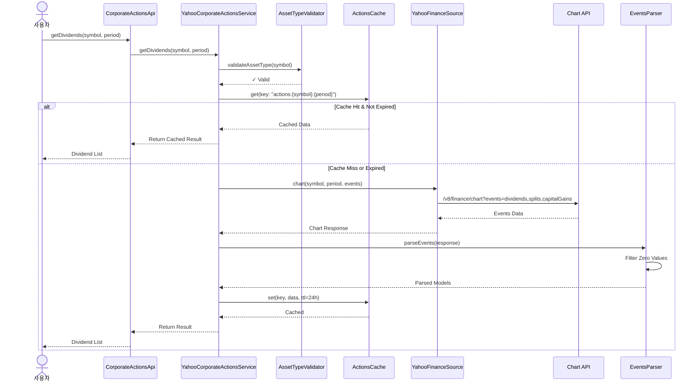

# UFC.CORP 기술명세서 (Technical Specification)

## 문서 정보
- **버전**: 1.0.0
- **최종 수정일**: 2025-12-03
- **작성자**: Claude Code (Software Architect)
- **문서 상태**: Design Specification
- **문서 유형**: 설계 명세서 (코드 구현 제외)

---

## 목차
1. [개요](#1-개요)
2. [아키텍처 설계](#2-아키텍처-설계)
3. [데이터 모델 정의](#3-데이터-모델-정의)
4. [서비스 인터페이스](#4-서비스-인터페이스)
5. [API 명세](#5-api-명세)
6. [데이터 처리 흐름](#6-데이터-처리-흐름)
7. [에러 처리 전략](#7-에러-처리-전략)
8. [캐싱 전략](#8-캐싱-전략)
9. [테스트 전략](#9-테스트-전략)
10. [구현 고려사항](#10-구현-고려사항)
11. [파일 구조](#11-파일-구조)
12. [향후 확장](#12-향후-확장)

---

## 1. 개요

### 1.1 목적

Corp 도메인은 Yahoo Finance를 통해 금융 상품의 기업 행동(Corporate Actions) 정보를 제공하는 통합 서비스입니다.

**핵심 기능:**
- 배당금(Dividends) 히스토리 조회
- 주식 분할(Stock Splits) 히스토리 조회
- 자본이득(Capital Gains) 히스토리 조회
- 통합 기업 행동(Actions) 조회
- 자산 유형별 기능 차별화 (MUTUALFUND 분할 제외)
- 다양한 기간(Period) 지원

### 1.2 범위

**지원 자산 유형별 기능 매트릭스:**

| 자산 유형 | 배당금 (Dividends) | 주식 분할 (Splits) | 자본이득 (Capital Gains) | 통합 조회 (Actions) |
|----------|-------------------|-------------------|------------------------|-------------------|
| **EQUITY (주식)** | ✅ 완전 지원 | ✅ 완전 지원 | ✅ 완전 지원 | ✅ 완전 지원 |
| **ETF** | ✅ 완전 지원 | ⚠️ 제한적 지원 (드물게 발생) | ✅ 완전 지원 | ✅ 완전 지원 |
| **MUTUALFUND** | ✅ 완전 지원 | ❌ 지원 안 함 | ✅ 완전 지원 | ✅ 완전 지원 (분할 제외) |
| **INDEX** | ❌ 지원 안 함 | ❌ 지원 안 함 | ❌ 지원 안 함 | ❌ 지원 안 함 |
| **CRYPTOCURRENCY** | ❌ 지원 안 함 | ❌ 지원 안 함 | ❌ 지원 안 함 | ❌ 지원 안 함 |

**주요 특징:**
- **배당금**: 모든 배당 가능 자산 유형 지원 (주식, ETF, 펀드)
- **주식 분할**: MUTUALFUND 제외 (뮤추얼펀드는 분할 안 함)
- **자본이득**: 주식, ETF, 펀드 모두 지원
- **통합 조회**: 모든 기업 행동을 하나의 통합 뷰로 제공

### 1.3 데이터 소스

**Yahoo Finance Chart API:**

**엔드포인트:**
```
https://query2.finance.yahoo.com/v8/finance/chart/{symbol}
```

**제공 데이터:**
- `events.dividends`: 배당금 이벤트 맵 (날짜 → 배당액)
- `events.splits`: 주식 분할 이벤트 맵 (날짜 → 분할 비율)
- `events.capitalGains`: 자본이득 분배 이벤트 맵 (날짜 → 분배액)

**인증:**
- Cookie + Crumb 토큰 기반 인증
- YahooFinanceSource의 인증 메커니즘 재사용

### 1.4 yfinance 호환성

**Python yfinance의 기업 행동 관련 기능을 Kotlin으로 이식:**

| yfinance 메서드 | UFC.CORP 메서드 | 설명 |
|----------------|----------------|------|
| `Ticker.dividends` | `getDividends()` | 배당금 히스토리 |
| `Ticker.splits` | `getStockSplits()` | 주식 분할 히스토리 |
| `Ticker.capital_gains` | `getCapitalGains()` | 자본이득 히스토리 |
| `Ticker.actions` | `getActions()` | 통합 기업 행동 |

**주요 차이점:**
- 타입 안전성: Kotlin의 강타입 시스템 활용
- Null 안전성: 선택적 데이터에 대한 Nullable 타입 명시
- 자산 유형 검증: MUTUALFUND에 대한 splits 요청 시 에러 처리
- 0값 필터링: 의미 없는 0값 자동 제거

### 1.5 Chart API와의 관계

**UFC 프로젝트의 기존 ChartService와의 관계:**

| 항목 | ChartService | CorporateActionsApi |
|-----|-------------|-------------------|
| **목적** | OHLCV 히스토리 데이터 전문 | 기업 행동 이벤트 전문 |
| **엔드포인트** | chart API (indicators 사용) | chart API (events 사용) |
| **반환 모델** | `OHLCVData` | `Dividend`, `StockSplit`, `CapitalGain`, `CorporateAction` |
| **데이터 구조** | timestamp 배열 + quote 배열 | events 맵 (timestamp → value) |
| **캐싱** | 없음 | TTL 기반 캐싱 (24시간) |

**통합 전략:**
- CorporateActionsApi는 ChartService와 독립적으로 chart API 호출
- 동일한 YahooFinanceSource 공유
- 다른 데이터 파싱 로직 (events vs indicators)

### 1.6 기술 스택

| 레이어 | 기술 |
|--------|------|
| **언어** | Kotlin 1.9+ |
| **HTTP Client** | Ktor Client |
| **직렬화** | Kotlinx Serialization |
| **동시성** | Kotlin Coroutines |
| **캐싱** | ConcurrentHashMap (In-Memory) |
| **테스트** | JUnit 5, Kotest, MockK |

---

## 2. 아키텍처 설계

### 2.1 레이어 구조

```mermaid
graph TB
    subgraph "애플리케이션 계층"
        AppLayer["👤 User Application<br/>사용자 애플리케이션"]
    end

    subgraph "도메인 API 계층"
        ApiInterface["🔌 CorporateActionsApi<br/>인터페이스 정의<br/>━━━━━━━━━━━━━━<br/>📊 getDividends<br/>📊 getStockSplits<br/>📊 getCapitalGains<br/>📊 getActions<br/>📊 getRawActions"]
    end

    subgraph "내부 구현 계층"
        ServiceImpl["⚙️ YahooCorporateActionsService<br/>서비스 구현<br/>━━━━━━━━━━━━━━<br/>• 비즈니스 로직<br/>• 입력 검증<br/>• 캐시 관리<br/>• API 호출"]

        subgraph "보조 컴포넌트"
            Parser["🔍 EventsParser<br/>응답 파싱"]
            Validator["✓ AssetTypeValidator<br/>자산 타입 검증"]
            Cache["💾 ActionsCache<br/>캐시 관리"]
        end
    end

    subgraph "데이터 소스 계층"
        DataSource["🌐 YahooFinanceSource<br/>데이터 추상화<br/>━━━━━━━━━━━━━━<br/>chart API 호출"]
        ChartAPI["📡 Chart API<br/>/v8/finance/chart<br/>events 파라미터"]
    end

    subgraph "도메인 모델"
        Models["📦 Domain Models<br/>━━━━━━━━━━━━━━<br/>• Dividend<br/>• StockSplit<br/>• CapitalGain<br/>• CorporateAction<br/>• Metadata"]
    end

    AppLayer --> ApiInterface
    ApiInterface --> ServiceImpl
    ServiceImpl --> Parser
    ServiceImpl --> Validator
    ServiceImpl --> Cache
    ServiceImpl --> DataSource
    DataSource --> ChartAPI
    Parser --> Models

### 2.2 컴포넌트 다이어그램

```mermaid
graph TD
    subgraph Client["📱 Application Layer"]
        User["User Application"]
    end

    subgraph API["🔌 Domain API"]
        CorporateActionsApi["CorporateActionsApi<br/>Interface"]
    end

    subgraph Service["⚙️ Implementation Layer"]
        YahooCorporateActionsService["YahooCorporateActionsService<br/>Service Implementation"]
        EventsParser["EventsParser<br/>Response Parser"]
        AssetTypeValidator["AssetTypeValidator<br/>Asset Type Checker"]
        ActionsCache["ActionsCache<br/>Caching Layer"]
    end

    subgraph DataLayer["📡 Data Source Layer"]
        YahooFinanceSource["YahooFinanceSource<br/>Data Abstraction"]
        ChartAPI["Chart API<br/>/v8/finance/chart"]
    end

    subgraph Models["📦 Domain Models"]
        Dividend["Dividend<br/>배당금"]
        StockSplit["StockSplit<br/>주식분할"]
        CapitalGain["CapitalGain<br/>자본이득"]
        CorporateAction["CorporateAction<br/>통합 기업 행동"]
        Metadata["CorporateActionsMetadata<br/>메타데이터"]
    end

    User -->|요청| CorporateActionsApi
    CorporateActionsApi -->|구현| YahooCorporateActionsService
    YahooCorporateActionsService -->|1. 입력 검증| AssetTypeValidator
    YahooCorporateActionsService -->|2. 캐시 조회| ActionsCache
    YahooCorporateActionsService -->|3. API 호출| YahooFinanceSource
    YahooFinanceSource -->|4. Chart API| ChartAPI
    ChartAPI -->|5. 응답| EventsParser
    EventsParser -->|파싱| Dividend
    EventsParser -->|파싱| StockSplit
    EventsParser -->|파싱| CapitalGain
    EventsParser -->|통합| CorporateAction
    YahooCorporateActionsService -->|메타데이터| Metadata
    YahooCorporateActionsService -->|캐시 저장| ActionsCache
    ActionsCache -->|반환| User
```

### 2.3 주요 컴포넌트 책임

| 컴포넌트 | 책임 | 주요 메서드 |
|---------|------|-----------|
| **CorporateActionsApi** | 도메인 인터페이스 정의 | getDividends(), getStockSplits(), getActions() |
| **YahooCorporateActionsService** | 비즈니스 로직 구현, 캐싱 관리 | fetchChartEvents(), validateAssetType() |
| **EventsParser** | Chart API 응답 파싱 | parseDividends(), parseSplits(), parseCapitalGains() |
| **AssetTypeValidator** | 자산 유형별 기능 검증 | validateSplitsSupport(assetType) |
| **ActionsCache** | 캐시 저장 및 조회 | get(), set(), invalidate() |
| **YahooFinanceSource** | 데이터 소스 추상화 | chart(symbol, period, events) |

### 2.4 데이터 흐름 개요



---

## 3. 데이터 모델 정의

### 3.1 Domain 모델 (Public API)

#### 3.1.1 Dividend (배당금)

**목적:** 특정 날짜에 지급된 배당금 정보

**필드 정의:**

| 필드 | 타입 | Nullable | 설명 | 검증 규칙 |
|-----|------|----------|------|----------|
| date | Long | N | 배당 기준일 (Unix timestamp, seconds) | > 0 |
| amount | Double | N | 배당금액 (주당) | > 0.0 |
| currency | String | Y | 통화 코드 (예: USD, KRW) | ISO 4217 |

**특징:**
- 정렬: 날짜 오름차순 (과거 → 현재)
- 0값 필터링: amount가 0인 레코드 자동 제거
- 중복 제거: 동일 날짜에 중복 배당 시 최신 값 사용

**사용 사례:**
- 배당 수익률 계산
- 배당 히스토리 시각화
- 배당 성장률 분석

#### 3.1.2 StockSplit (주식 분할)

**목적:** 주식 분할 이벤트 정보

**필드 정의:**

| 필드 | 타입 | Nullable | 설명 | 검증 규칙 |
|-----|------|----------|------|----------|
| date | Long | N | 분할 기준일 (Unix timestamp, seconds) | > 0 |
| ratio | Double | N | 분할 비율 (예: 2.0 = 2:1 분할) | > 0.0 |
| description | String | Y | 분할 설명 (예: "2-for-1 split") | - |

**분할 비율 해석:**
- `ratio = 2.0`: 1주 → 2주 (2:1 분할)
- `ratio = 0.5`: 2주 → 1주 (1:2 역분할)
- `ratio = 3.0`: 1주 → 3주 (3:1 분할)
- `ratio = 1.5`: 2주 → 3주 (3:2 분할)

**자산 유형별 지원:**
- EQUITY: ✅ 완전 지원
- ETF: ⚠️ 지원하지만 드물게 발생
- MUTUALFUND: ❌ 지원 안 함 (API 호출 시 에러)

**특징:**
- 정렬: 날짜 오름차순
- 중복 제거: 동일 날짜에 중복 분할 시 최신 값 사용
- 역사적 가격 조정: 분할 전 가격은 조정 필요

**사용 사례:**
- 역사적 가격 데이터 조정
- 주식 분할 히스토리 추적
- 분할 전후 가격 비교

#### 3.1.3 CapitalGain (자본이득)

**목적:** 펀드의 자본이득 분배 정보 (주로 ETF, MUTUALFUND)

**필드 정의:**

| 필드 | 타입 | Nullable | 설명 | 검증 규칙 |
|-----|------|----------|------|----------|
| date | Long | N | 분배 기준일 (Unix timestamp, seconds) | > 0 |
| amount | Double | N | 자본이득 분배액 (주당) | > 0.0 |
| type | CapitalGainType | Y | 단기/장기 구분 | SHORT_TERM, LONG_TERM, MIXED |
| currency | String | Y | 통화 코드 | ISO 4217 |

**CapitalGainType 열거형:**
- `SHORT_TERM`: 단기 자본이득 (보유 기간 1년 미만)
- `LONG_TERM`: 장기 자본이득 (보유 기간 1년 이상)
- `MIXED`: 혼합 (단기+장기)
- `null`: 구분 정보 없음

**자산 유형별 발생:**
- EQUITY: 드물게 발생 (특수한 경우)
- ETF: 자주 발생 (연말 분배)
- MUTUALFUND: 자주 발생 (연말 분배)

**특징:**
- 정렬: 날짜 오름차순
- 0값 필터링: amount가 0인 레코드 자동 제거
- 세금 영향: 자본이득 분배 시 과세 대상

**사용 사례:**
- 세금 계산
- 총 수익률 분석
- 펀드 효율성 평가

#### 3.1.4 CorporateAction (통합 기업 행동)

**목적:** 모든 기업 행동을 하나의 통합 뷰로 제공

**필드 정의:**

| 필드 | 타입 | Nullable | 설명 |
|-----|------|----------|------|
| symbol | String | N | 심볼 (예: AAPL) |
| dividends | List&lt;Dividend&gt; | N | 배당금 목록 (빈 리스트 가능) |
| stockSplits | List&lt;StockSplit&gt; | N | 주식 분할 목록 (빈 리스트 가능) |
| capitalGains | List&lt;CapitalGain&gt; | N | 자본이득 목록 (빈 리스트 가능) |
| metadata | CorporateActionsMetadata | N | 메타데이터 |

**특징:**
- 모든 리스트는 날짜 오름차순 정렬
- 빈 리스트: 해당 기업 행동이 없는 경우 (null이 아님)
- MUTUALFUND: stockSplits는 항상 빈 리스트
- 통합 조회 권장: 개별 조회보다 효율적 (1번의 API 호출)

**사용 사례:**
- 전체 기업 행동 히스토리 조회
- 배당+분할 통합 분석
- 역사적 이벤트 타임라인

#### 3.1.5 CorporateActionsMetadata (메타데이터)

**목적:** 기업 행동 조회 결과의 메타 정보

**필드 정의:**

| 필드 | 타입 | Nullable | 설명 |
|-----|------|----------|------|
| symbol | String | N | 심볼 |
| period | String | N | 조회 기간 (예: "1y", "max") |
| currency | String | Y | 통화 코드 |
| assetType | AssetType | Y | 자산 유형 (EQUITY, ETF, MUTUALFUND) |
| dataRange | DateRange | Y | 실제 데이터 범위 (시작일, 종료일) |
| fetchedAt | Long | N | 조회 시각 (Unix timestamp, millis) |
| source | String | N | 데이터 소스 (예: "YahooFinance") |

**DateRange 구조:**

| 필드 | 타입 | 설명 |
|-----|------|------|
| start | Long | 시작 날짜 (Unix timestamp, seconds) |
| end | Long | 종료 날짜 (Unix timestamp, seconds) |

**AssetType 열거형:**
- `EQUITY`: 주식
- `ETF`: 상장지수펀드
- `MUTUALFUND`: 뮤추얼펀드
- `INDEX`: 지수 (기업 행동 지원 안 함)
- `CRYPTOCURRENCY`: 암호화폐 (기업 행동 지원 안 함)
- `UNKNOWN`: 알 수 없음

**사용 사례:**
- 데이터 유효성 검증
- 캐시 키 생성
- 디버깅 및 로깅

### 3.2 Response 모델 (Internal)

#### 3.2.1 ChartResponse (chart API 응답)

Chart API 응답은 기존 ChartService와 동일한 구조를 사용하지만, `events` 필드에 집중합니다.

**주요 구조:**

```json
{
  "chart": {
    "result": [
      {
        "meta": { ... },
        "timestamp": [...],
        "events": {
          "dividends": {
            "1609459200": {
              "amount": 0.205,
              "date": 1609459200
            },
            "1617235200": {
              "amount": 0.22,
              "date": 1617235200
            }
          },
          "splits": {
            "1598889600": {
              "date": 1598889600,
              "numerator": 4,
              "denominator": 1,
              "splitRatio": "4:1"
            }
          },
          "capitalGains": {
            "1640995200": {
              "amount": 1.25,
              "date": 1640995200
            }
          }
        }
      }
    ]
  }
}
```

#### 3.2.2 EventsRaw (events 맵)

**DividendEventRaw:**

| 필드 | 타입 | 설명 |
|-----|------|------|
| amount | Double | 배당금액 |
| date | Long | 배당 기준일 (Unix timestamp, seconds) |

**SplitEventRaw:**

| 필드 | 타입 | 설명 |
|-----|------|------|
| date | Long | 분할 기준일 |
| numerator | Int | 분자 (예: 4:1에서 4) |
| denominator | Int | 분모 (예: 4:1에서 1) |
| splitRatio | String | 분할 비율 문자열 (예: "4:1") |

**CapitalGainEventRaw:**

| 필드 | 타입 | 설명 |
|-----|------|------|
| amount | Double | 자본이득액 |
| date | Long | 분배 기준일 |

### 3.3 데이터 변환 전략

**변환 규칙:**

| Response 모델 | Domain 모델 | 변환 규칙 |
|--------------|------------|----------|
| `DividendEventRaw` | `Dividend` | amount > 0 필터링, currency 추가 |
| `SplitEventRaw` | `StockSplit` | numerator/denominator → ratio 계산, description 생성 |
| `CapitalGainEventRaw` | `CapitalGain` | amount > 0 필터링, type 추론, currency 추가 |
| `EventsRaw` | `CorporateAction` | 위 3개 통합 + metadata 생성 |

**분할 비율 계산:**
```
ratio = numerator / denominator

예시:
- numerator=4, denominator=1 → ratio=4.0 (4:1 분할)
- numerator=1, denominator=2 → ratio=0.5 (1:2 역분할)
- numerator=3, denominator=2 → ratio=1.5 (3:2 분할)
```

**0값 필터링 로직:**
- 배당금: amount == 0.0 제외
- 자본이득: amount == 0.0 제외
- 분할: ratio == 1.0 제외 (실제 분할 없음)

**날짜 정렬:**
- 모든 이벤트 목록은 날짜 오름차순 정렬
- Map<Long, Event> → List<Event>.sortedBy { it.date }

**변환 위치:**
- `YahooCorporateActionsService` 내부 private 메서드
- 응답 모델은 외부 노출 금지

---

## 4. 서비스 인터페이스

### 4.1 CorporateActionsApi (Public Interface)

#### 4.1.1 배당금 조회

**단일 심볼 조회:**

**메서드 시그니처:**
```kotlin
suspend fun getDividends(
    symbol: String,
    period: Period = Period.Max
): List<Dividend>
```

**파라미터:**
- `symbol`: 심볼 (예: "AAPL", "SPY", "VTSAX")
- `period`: 조회 기간 (기본값: Period.Max = 전체 히스토리)

**반환값:**
- `List<Dividend>`: 배당금 목록 (날짜 오름차순 정렬)
- 빈 리스트: 배당금이 없는 경우

**예외:**
- `InvalidSymbolException`: 심볼 형식 오류
- `CorporateActionsDataNotFoundException`: 데이터 없음 (404)
- `UFCException`: 기타 에러

---

**다중 심볼 조회:**

**메서드 시그니처:**
```kotlin
suspend fun getDividends(
    symbols: List<String>,
    period: Period = Period.Max
): Map<String, List<Dividend>>
```

**파라미터:**
- `symbols`: 심볼 목록 (최대 50개)
- `period`: 조회 기간

**반환값:**
- `Map<String, List<Dividend>>`: 심볼별 배당금 목록
- 실패한 심볼은 Map에서 제외됨

**동시성:**
- 병렬 조회 (coroutineScope + async)
- 최대 동시 실행 수: 10개

#### 4.1.2 주식 분할 조회

**단일 심볼 조회:**

**메서드 시그니처:**
```kotlin
suspend fun getStockSplits(
    symbol: String,
    period: Period = Period.Max
): List<StockSplit>
```

**파라미터:**
- `symbol`: 심볼 (MUTUALFUND 제외)
- `period`: 조회 기간

**반환값:**
- `List<StockSplit>`: 분할 목록 (날짜 오름차순 정렬)
- 빈 리스트: 분할이 없는 경우

**예외:**
- `InvalidSymbolException`: 심볼 형식 오류
- `UnsupportedAssetTypeException`: MUTUALFUND에 대한 분할 조회 시
- `CorporateActionsDataNotFoundException`: 데이터 없음
- `UFCException`: 기타 에러

**자산 유형 검증:**
- EQUITY: ✅ 허용
- ETF: ✅ 허용 (드물게 발생)
- MUTUALFUND: ❌ UnsupportedAssetTypeException

---

**다중 심볼 조회:**

**메서드 시그니처:**
```kotlin
suspend fun getStockSplits(
    symbols: List<String>,
    period: Period = Period.Max
): Map<String, List<StockSplit>>
```

**파라미터:**
- `symbols`: 심볼 목록 (MUTUALFUND 제외, 최대 50개)
- `period`: 조회 기간

**반환값:**
- `Map<String, List<StockSplit>>`: 심볼별 분할 목록
- MUTUALFUND 심볼은 자동 필터링 또는 빈 리스트 반환

#### 4.1.3 자본이득 조회

**단일 심볼 조회:**

**메서드 시그니처:**
```kotlin
suspend fun getCapitalGains(
    symbol: String,
    period: Period = Period.Max
): List<CapitalGain>
```

**파라미터:**
- `symbol`: 심볼
- `period`: 조회 기간

**반환값:**
- `List<CapitalGain>`: 자본이득 목록 (날짜 오름차순 정렬)
- 빈 리스트: 자본이득이 없는 경우

**예외:**
- `InvalidSymbolException`: 심볼 형식 오류
- `CorporateActionsDataNotFoundException`: 데이터 없음
- `UFCException`: 기타 에러

---

**다중 심볼 조회:**

**메서드 시그니처:**
```kotlin
suspend fun getCapitalGains(
    symbols: List<String>,
    period: Period = Period.Max
): Map<String, List<CapitalGain>>
```

**파라미터:**
- `symbols`: 심볼 목록 (최대 50개)
- `period`: 조회 기간

**반환값:**
- `Map<String, List<CapitalGain>>`: 심볼별 자본이득 목록

#### 4.1.4 통합 기업 행동 조회 (권장)

**단일 심볼 조회:**

**메서드 시그니처:**
```kotlin
suspend fun getActions(
    symbol: String,
    period: Period = Period.Max
): CorporateAction
```

**파라미터:**
- `symbol`: 심볼
- `period`: 조회 기간

**반환값:**
- `CorporateAction`: 배당금, 분할, 자본이득 통합 데이터
- 빈 리스트들: 해당 기업 행동이 없는 경우

**장점:**
- 1번의 API 호출로 모든 기업 행동 조회
- 개별 조회 대비 효율적
- 캐시 효율성 향상

**예외:**
- `InvalidSymbolException`: 심볼 형식 오류
- `CorporateActionsDataNotFoundException`: 데이터 없음
- `UFCException`: 기타 에러

---

**다중 심볼 조회:**

**메서드 시그니처:**
```kotlin
suspend fun getActions(
    symbols: List<String>,
    period: Period = Period.Max
): Map<String, CorporateAction>
```

**파라미터:**
- `symbols`: 심볼 목록 (최대 50개)
- `period`: 조회 기간

**반환값:**
- `Map<String, CorporateAction>`: 심볼별 통합 기업 행동

**동시성:**
- 병렬 조회 (최대 10개 동시 실행)
- 실패한 심볼은 Map에서 제외

#### 4.1.5 Raw API 조회

**메서드 시그니처:**
```kotlin
suspend fun getRawActions(
    symbol: String,
    period: Period = Period.Max
): ChartResponse
```

**파라미터:**
- `symbol`: 심볼
- `period`: 조회 기간

**반환값:**
- `ChartResponse`: Chart API 원본 응답 (events 포함)

**사용 사례:**
- 디버깅
- 커스텀 파싱
- Yahoo Finance 원본 데이터 접근

### 4.2 YahooCorporateActionsService (Internal Implementation)

**구조:**

```kotlin
internal class YahooCorporateActionsService(
    private val httpClient: HttpClient,
    private val rateLimiter: RateLimiter,
    private val authResult: AuthResult
) : CorporateActionsApi {

    // 캐시: "actions:{symbol}:{period}" -> CachedActionsData
    private val actionsCache = ConcurrentHashMap<String, CachedActionsData>()

    // 캐시 TTL 설정
    companion object {
        const val ACTIONS_TTL_MILLIS = 86_400_000L  // 24시간
        const val MAX_CONCURRENT_REQUESTS = 10
        const val MAX_BATCH_SIZE = 50
    }

    // Public API 구현
    override suspend fun getDividends(symbol: String, period: Period): List<Dividend>
    override suspend fun getDividends(symbols: List<String>, period: Period): Map<String, List<Dividend>>
    override suspend fun getStockSplits(symbol: String, period: Period): List<StockSplit>
    override suspend fun getStockSplits(symbols: List<String>, period: Period): Map<String, List<StockSplit>>
    override suspend fun getCapitalGains(symbol: String, period: Period): List<CapitalGain>
    override suspend fun getCapitalGains(symbols: List<String>, period: Period): Map<String, List<CapitalGain>>
    override suspend fun getActions(symbol: String, period: Period): CorporateAction
    override suspend fun getActions(symbols: List<String>, period: Period): Map<String, CorporateAction>
    override suspend fun getRawActions(symbol: String, period: Period): ChartResponse

    // Private 헬퍼 메서드
    private suspend fun fetchChartEvents(symbol: String, period: Period): ChartResponse
    private fun validateSymbol(symbol: String)
    private suspend fun validateAssetType(symbol: String, operation: String)
    private fun parseDividends(eventsMap: Map<Long, DividendEventRaw>?, currency: String?): List<Dividend>
    private fun parseSplits(eventsMap: Map<Long, SplitEventRaw>?): List<StockSplit>
    private fun parseCapitalGains(eventsMap: Map<Long, CapitalGainEventRaw>?, currency: String?): List<CapitalGain>
    private fun mergeActions(dividends: List<Dividend>, splits: List<StockSplit>, gains: List<CapitalGain>, metadata: CorporateActionsMetadata): CorporateAction
    private fun filterZeroValues<T>(events: List<T>, amountGetter: (T) -> Double): List<T>
    private fun createMetadata(symbol: String, period: Period, chartResponse: ChartResponse): CorporateActionsMetadata
    private fun getCachedActions(symbol: String, period: Period): CorporateAction?
    private fun setCachedActions(symbol: String, period: Period, data: CorporateAction)
    private fun generateCacheKey(symbol: String, period: Period): String
}
```

---

## 5. API 명세

### 5.1 Yahoo Finance Chart API (Events 파라미터)

**Base URL:**
```
https://query2.finance.yahoo.com/v8/finance/chart/{symbol}
```

**Request Method:** GET

**Query Parameters:**

| 파라미터 | 타입 | 필수 | 설명 | 예시 |
|---------|------|------|------|------|
| range | String | Y | 조회 기간 | "1y", "5y", "max" |
| events | String | Y | 포함할 이벤트 타입 | "div,split,capitalGains" |
| crumb | String | Y | 인증 토큰 | "xxx" |
| corsDomain | String | N | CORS 도메인 | "finance.yahoo.com" |

**Events 파라미터 값:**
- `div`: 배당금 (dividends)
- `split`: 주식 분할 (splits)
- `capitalGains`: 자본이득 분배
- 조합: `"div,split,capitalGains"` (쉼표로 구분)

**Period 파라미터 지원:**

| Period | range 값 | 설명 |
|--------|----------|------|
| Period.OneMonth | "1mo" | 1개월 |
| Period.ThreeMonths | "3mo" | 3개월 |
| Period.SixMonths | "6mo" | 6개월 |
| Period.OneYear | "1y" | 1년 |
| Period.TwoYears | "2y" | 2년 |
| Period.FiveYears | "5y" | 5년 |
| Period.TenYears | "10y" | 10년 |
| Period.YearToDate | "ytd" | 연초부터 현재까지 |
| Period.Max | "max" | 전체 히스토리 (권장) |

### 5.2 Request Example

**배당금 + 분할 + 자본이득 통합 조회:**
```http
GET /v8/finance/chart/AAPL?range=max&events=div,split,capitalGains&crumb=xxx HTTP/1.1
Host: query2.finance.yahoo.com
Cookie: A3=xxx
User-Agent: Mozilla/5.0
```

**배당금만 조회:**
```http
GET /v8/finance/chart/SPY?range=1y&events=div&crumb=xxx HTTP/1.1
Host: query2.finance.yahoo.com
Cookie: A3=xxx
```

### 5.3 Response Structure (Success)

**전체 구조:**

```json
{
  "chart": {
    "result": [
      {
        "meta": {
          "symbol": "AAPL",
          "currency": "USD",
          "exchangeName": "NMS",
          "instrumentType": "EQUITY"
        },
        "timestamp": [],
        "events": {
          "dividends": {
            "1609459200": {
              "amount": 0.205,
              "date": 1609459200
            },
            "1617235200": {
              "amount": 0.22,
              "date": 1617235200
            }
          },
          "splits": {
            "1598889600": {
              "date": 1598889600,
              "numerator": 4,
              "denominator": 1,
              "splitRatio": "4:1"
            }
          },
          "capitalGains": {}
        }
      }
    ],
    "error": null
  }
}
```

**배당금 이벤트 상세:**

```json
"dividends": {
  "1609459200": {
    "amount": 0.205,
    "date": 1609459200
  }
}
```

- Key: Unix timestamp (seconds)
- Value: 배당금 상세 정보

**분할 이벤트 상세:**

```json
"splits": {
  "1598889600": {
    "date": 1598889600,
    "numerator": 4,
    "denominator": 1,
    "splitRatio": "4:1"
  }
}
```

- Key: Unix timestamp (seconds)
- Value: 분할 비율 정보

**자본이득 이벤트 상세:**

```json
"capitalGains": {
  "1640995200": {
    "amount": 1.25,
    "date": 1640995200
  }
}
```

- Key: Unix timestamp (seconds)
- Value: 자본이득 분배액

### 5.4 Error Response

**심볼 없음 (404):**

```json
{
  "chart": {
    "result": null,
    "error": {
      "code": "Not Found",
      "description": "No data found for symbol INVALID"
    }
  }
}
```

**인증 실패 (401):**

```json
{
  "chart": {
    "result": null,
    "error": {
      "code": "Unauthorized",
      "description": "Invalid crumb"
    }
  }
}
```

### 5.5 Rate Limiting

**제한:**
- Yahoo Finance: 비공식 제한 (추정 2000 req/hour)
- chart API: 공유 Rate Limiter (PriceApi와 동일 엔드포인트)

**전략:**
- TokenBucket Rate Limiter 적용
- Exponential Backoff (429 응답 시)
- Cache 우선 사용 (TTL: 24시간)

**Rate Limiter 설정:**

| API | Tokens/Second | Burst Size |
|-----|---------------|------------|
| chart | 10 | 20 |

### 5.6 배치 조회 전략

**병렬 처리:**
- 최대 동시 실행: 10개 (MAX_CONCURRENT_REQUESTS)
- semaphore 사용: `Semaphore(10)`
- 순차 실행 방지

**최적화:**
- 캐시 Hit 심볼: API 호출 생략
- 실패한 심볼: 로깅 후 건너뛰기
- 부분 성공: 성공한 심볼만 반환

---

## 6. 데이터 처리 흐름

### 6.1 getActions() 흐름도 (통합 조회)

```
User Request: getActions("AAPL", Period.Max)
    ↓
[1] 입력 검증
    - 심볼 형식 검증
    - Period 유효성 검증
    ↓
[2] 캐시 조회
    - Key: "actions:AAPL:max"
    ↓
    ├─> Cache Hit && Not Expired (< 24시간)
    │   → CorporateAction 반환 (API 호출 생략)
    │
    └─> Cache Miss || Expired
         ↓
        [3] Rate Limiter 토큰 획득
            ↓
        [4] Chart API 호출
            - URL: /v8/finance/chart/AAPL
            - Query: range=max&events=div,split,capitalGains&crumb=xxx
            - 인증: Cookie + Crumb
            ↓
        [5] 응답 검증
            - HTTP 상태 확인 (200 OK)
            - chart.error 필드 확인 (null)
            - chart.result null/empty 체크
            ↓
        [6] 이벤트 파싱
            ├─> [6-1] parseDividends(events.dividends, currency)
            │   - Map<Long, DividendEventRaw> → List<Dividend>
            │   - amount > 0 필터링
            │   - 날짜 오름차순 정렬
            │
            ├─> [6-2] parseSplits(events.splits)
            │   - Map<Long, SplitEventRaw> → List<StockSplit>
            │   - ratio 계산 (numerator/denominator)
            │   - description 생성 (예: "4-for-1 split")
            │   - ratio != 1.0 필터링
            │   - 날짜 오름차순 정렬
            │
            └─> [6-3] parseCapitalGains(events.capitalGains, currency)
                - Map<Long, CapitalGainEventRaw> → List<CapitalGain>
                - amount > 0 필터링
                - type 추론 (현재는 null)
                - 날짜 오름차순 정렬
            ↓
        [7] 메타데이터 생성
            - createMetadata(symbol, period, chartResponse)
            - assetType, currency, dataRange 추출
            ↓
        [8] CorporateAction 생성
            - mergeActions(dividends, splits, gains, metadata)
            ↓
        [9] 캐시 저장
            - TTL: 24시간 (ACTIONS_TTL_MILLIS)
            - Key: "actions:AAPL:max"
            ↓
        [10] CorporateAction 반환
```

### 6.2 getDividends() 흐름도

```
User Request: getDividends("AAPL", Period.OneYear)
    ↓
[1] 입력 검증
    ↓
[2] 캐시 조회 (전체 CorporateAction)
    - Key: "actions:AAPL:1y"
    ↓
    ├─> Cache Hit
    │   → CorporateAction.dividends 반환
    │
    └─> Cache Miss
         ↓
        [3] getActions("AAPL", Period.OneYear) 호출
            ↓
        [4] CorporateAction.dividends 추출
            ↓
        [5] List<Dividend> 반환
```

**최적화:**
- getDividends()는 내부적으로 getActions() 호출
- 캐시는 CorporateAction 전체를 저장
- 개별 조회 시 전체에서 필터링

### 6.3 getStockSplits() 흐름도 (자산 유형 검증 포함)

```
User Request: getStockSplits("VTSAX", Period.Max)
    ↓
[1] 입력 검증
    - 심볼 형식 검증
    ↓
[2] 자산 유형 검증
    - validateAssetType("VTSAX", "stockSplits")
    ↓
    [2-1] 자산 유형 조회 (옵션)
        - QuoteSummary API 호출 (quoteType 모듈)
        - assetType == MUTUALFUND 확인
        ↓
    [2-2] 검증 실패
        - MUTUALFUND인 경우
        - throw UnsupportedAssetTypeException(
            "Stock splits are not supported for MUTUALFUND: VTSAX"
          )
        - 예외 throw → 처리 종료
        ↓
    [2-3] 검증 성공
        - EQUITY, ETF인 경우
        - 계속 진행
        ↓
[3] 캐시 조회
    ↓
[4] getActions() 호출
    ↓
[5] CorporateAction.stockSplits 추출
    ↓
[6] List<StockSplit> 반환
```

**자산 유형 검증 옵션:**

**옵션 1: 사전 검증 (권장)**
- QuoteSummary API로 assetType 조회
- MUTUALFUND 확인 후 즉시 에러
- 불필요한 Chart API 호출 방지

**옵션 2: 사후 검증**
- Chart API 먼저 호출
- meta.instrumentType 확인
- MUTUALFUND 확인 후 빈 리스트 또는 에러

**옵션 3: 검증 생략**
- Chart API 호출만 수행
- MUTUALFUND도 splits 요청
- 빈 리스트 반환 (Yahoo API가 빈 응답)

**권장 전략: 옵션 2 (사후 검증)**
- 이유: Chart API 1번 호출로 충분
- meta.instrumentType으로 검증
- 추가 API 호출 불필요

### 6.4 getActions(symbols) 다중 조회 흐름도

```
User Request: getActions(listOf("AAPL", "GOOGL", "SPY"), Period.OneYear)
    ↓
[1] 입력 검증
    - 빈 리스트 체크
    - 심볼 개수 제한 (최대 50개)
    - 각 심볼 유효성 검증
    ↓
[2] 캐시 필터링
    - symbols.partition { getCachedActions(it, period) != null }
    - cachedSymbols: ["AAPL"] (캐시 Hit)
    - uncachedSymbols: ["GOOGL", "SPY"] (캐시 Miss)
    ↓
[3] 병렬 API 호출
    - Semaphore(MAX_CONCURRENT_REQUESTS) 사용
    - coroutineScope {
          uncachedSymbols.map { symbol ->
              async {
                  semaphore.withPermit {
                      getActions(symbol, period)
                  }
              }
          }.awaitAll()
      }
    ↓
[4] 에러 처리
    - 개별 심볼 실패 시 로깅
    - 실패 심볼은 Map에서 제외
    - 성공 심볼만 포함
    ↓
[5] 결과 병합
    - cachedResults: {"AAPL" → CorporateAction}
    - apiResults: {"GOOGL" → CorporateAction, "SPY" → CorporateAction}
    - merged: {"AAPL", "GOOGL", "SPY" → CorporateAction}
    ↓
[6] Map<String, CorporateAction> 반환
```

### 6.5 데이터 파싱 상세 흐름

#### 6.5.1 parseDividends()

```
Input: eventsMap = {
    1609459200: {amount: 0.205, date: 1609459200},
    1617235200: {amount: 0.22, date: 1617235200},
    1625011200: {amount: 0.0, date: 1625011200}  // 0값
}
    ↓
[1] Map을 List로 변환
    - eventsMap.values.toList()
    ↓
[2] 0값 필터링
    - filter { it.amount > 0.0 }
    - 결과: 2개 (0.205, 0.22)
    ↓
[3] 도메인 모델 변환
    - map { raw ->
          Dividend(
              date = raw.date,
              amount = raw.amount,
              currency = currency  // meta.currency
          )
      }
    ↓
[4] 날짜 오름차순 정렬
    - sortedBy { it.date }
    ↓
Output: List<Dividend> (2개, 정렬됨)
```

#### 6.5.2 parseSplits()

```
Input: eventsMap = {
    1598889600: {
        date: 1598889600,
        numerator: 4,
        denominator: 1,
        splitRatio: "4:1"
    }
}
    ↓
[1] Map을 List로 변환
    ↓
[2] ratio 계산
    - ratio = numerator / denominator
    - 예: 4 / 1 = 4.0
    ↓
[3] ratio != 1.0 필터링
    - filter { ratio != 1.0 }
    - (ratio=1.0은 실제 분할 아님)
    ↓
[4] 도메인 모델 변환
    - map { raw ->
          val ratio = raw.numerator.toDouble() / raw.denominator
          StockSplit(
              date = raw.date,
              ratio = ratio,
              description = raw.splitRatio?.let { "$it split" }
          )
      }
    ↓
[5] 날짜 오름차순 정렬
    ↓
Output: List<StockSplit>
```

#### 6.5.3 parseCapitalGains()

```
Input: eventsMap = {
    1640995200: {amount: 1.25, date: 1640995200},
    1672531200: {amount: 0.0, date: 1672531200}  // 0값
}
    ↓
[1] Map을 List로 변환
    ↓
[2] 0값 필터링
    - filter { it.amount > 0.0 }
    ↓
[3] 도메인 모델 변환
    - map { raw ->
          CapitalGain(
              date = raw.date,
              amount = raw.amount,
              type = null,  // Yahoo API는 type 제공 안 함
              currency = currency
          )
      }
    ↓
[4] 날짜 오름차순 정렬
    ↓
Output: List<CapitalGain>
```

### 6.6 에러 시나리오 흐름

```
API 호출 실패
    ↓
[1] HTTP Status 확인
    ├─> 401/403 → ErrorCode.AUTH_FAILED
    │   - 재인증 필요
    │   - Retry 없음
    │
    ├─> 404 → ErrorCode.CORPORATE_ACTIONS_DATA_NOT_FOUND
    │   - 심볼 없음 또는 데이터 없음
    │   - Retry 없음
    │
    ├─> 429 → ErrorCode.RATE_LIMITED
    │   - Rate Limit 초과
    │   - Exponential Backoff (최대 3회)
    │
    ├─> 500/502/503 → ErrorCode.EXTERNAL_API_ERROR
    │   - API 서버 오류
    │   - Exponential Backoff (최대 3회)
    │
    └─> 기타 → ErrorCode.DATA_RETRIEVAL_ERROR
        - 일반 에러
        - Retry 1회
    ↓
[2] Retry 로직
    - retry(maxAttempts = 3) {
          delay(exponentialBackoff(attempt))
          fetchChartEvents(symbol, period)
      }
    ↓
[3] UFCException 생성
    - errorCode 설정
    - message 설정
    - metadata 추가 (symbol, period, api, status)
    ↓
[4] Exception throw
```

---

## 7. 에러 처리 전략

### 7.1 에러 분류

| ErrorCode | HTTP Status | 설명 | Retry 여부 | 메시지 예시 |
|-----------|------------|------|-----------|----------|
| INVALID_SYMBOL | - | 심볼 형식 오류 | No | "Invalid symbol format: INVALID@123" |
| CORPORATE_ACTIONS_DATA_NOT_FOUND | 404 | 기업 행동 데이터 없음 | No | "No corporate actions data found for symbol: XYZ" |
| UNSUPPORTED_ASSET_TYPE | - | 지원하지 않는 자산 유형 | No | "Stock splits are not supported for MUTUALFUND: VTSAX" |
| INVALID_PERIOD | - | 유효하지 않은 Period | No | "Invalid period: null" |
| AUTH_FAILED | 401, 403 | 인증 실패 | No (재인증) | "Authentication failed: Invalid crumb" |
| RATE_LIMITED | 429 | Rate Limit 초과 | Yes (Backoff) | "Rate limit exceeded. Please try again later." |
| EXTERNAL_API_ERROR | 500+ | API 서버 오류 | Yes | "Yahoo Finance API error: 500 Internal Server Error" |
| DATA_PARSING_ERROR | - | 응답 파싱 오류 | No | "Failed to parse corporate actions data" |
| BATCH_SIZE_EXCEEDED | - | 배치 크기 초과 | No | "Batch size exceeded: 60 symbols (max: 50)" |

### 7.2 커스텀 예외

**UnsupportedAssetTypeException:**

```kotlin
class UnsupportedAssetTypeException(
    message: String,
    val symbol: String,
    val assetType: AssetType,
    val operation: String,
    cause: Throwable? = null
) : UFCException(ErrorCode.UNSUPPORTED_ASSET_TYPE, message, cause) {
    override val metadata: Map<String, Any> = mapOf(
        "symbol" to symbol,
        "assetType" to assetType.name,
        "operation" to operation
    )
}
```

**CorporateActionsDataNotFoundException:**

```kotlin
class CorporateActionsDataNotFoundException(
    message: String,
    val symbol: String,
    val period: String,
    cause: Throwable? = null
) : UFCException(ErrorCode.CORPORATE_ACTIONS_DATA_NOT_FOUND, message, cause) {
    override val metadata: Map<String, Any> = mapOf(
        "symbol" to symbol,
        "period" to period
    )
}
```

**BatchSizeExceededException:**

```kotlin
class BatchSizeExceededException(
    message: String,
    val requestedSize: Int,
    val maxSize: Int,
    cause: Throwable? = null
) : UFCException(ErrorCode.BATCH_SIZE_EXCEEDED, message, cause) {
    override val metadata: Map<String, Any> = mapOf(
        "requestedSize" to requestedSize,
        "maxSize" to maxSize
    )
}
```

### 7.3 자산 유형 검증 에러 처리

**시나리오: MUTUALFUND에 getStockSplits() 호출**

```
User: getStockSplits("VTSAX", Period.Max)
    ↓
Chart API 호출
    ↓
Response: {
    meta: {
        symbol: "VTSAX",
        instrumentType: "MUTUALFUND"
    },
    events: {
        splits: {}  // 빈 맵
    }
}
    ↓
검증 로직:
    if (meta.instrumentType == "MUTUALFUND" && operation == "splits") {
        throw UnsupportedAssetTypeException(
            message = "Stock splits are not supported for MUTUALFUND: VTSAX",
            symbol = "VTSAX",
            assetType = AssetType.MUTUALFUND,
            operation = "getStockSplits"
        )
    }
```

**처리 옵션:**

| 옵션 | 동작 | 장점 | 단점 |
|-----|------|------|------|
| **옵션 1: 예외 throw (권장)** | UnsupportedAssetTypeException | 명확한 에러 메시지, 사용자 교육 | 추가 처리 필요 |
| **옵션 2: 빈 리스트 반환** | return emptyList() | 에러 없음, 간단 | 사용자가 왜 빈지 모름 |
| **옵션 3: 경고 로그 + 빈 리스트** | log.warn() + emptyList() | 로그에 기록 | 사용자는 모름 |

**권장: 옵션 1 (예외 throw)**
- 이유: 사용자가 잘못된 요청을 명확히 인지
- 적용: getStockSplits() 단일 조회에만
- 배치 조회: 해당 심볼만 필터링 (예외 안 던짐)

### 7.4 Period 검증

**유효한 Period:**
- Period.OneMonth ~ Period.Max
- null 허용 안 함

**검증 로직:**

```kotlin
private fun validatePeriod(period: Period?) {
    if (period == null) {
        throw InvalidPeriodException("Period must not be null")
    }
    // Period enum이므로 추가 검증 불필요
}
```

### 7.5 배치 조회 에러 처리

**개별 심볼 실패 시:**
- 실패 심볼: 로그 기록 + Map에서 제외
- 성공 심볼: Map에 포함
- 부분 성공: 정상 반환 (일부 심볼만 포함)

**예시:**

```
Input: ["AAPL", "INVALID", "GOOGL"]
    ↓
"AAPL": 성공 → Map에 포함
"INVALID": 404 에러 → 로그 기록 + 제외
"GOOGL": 성공 → Map에 포함
    ↓
Output: {"AAPL" → CorporateAction, "GOOGL" → CorporateAction}
```

**로깅 전략:**

```kotlin
symbols.map { symbol ->
    async {
        try {
            symbol to getActions(symbol, period)
        } catch (e: Exception) {
            logger.warn("Failed to fetch corporate actions for symbol: $symbol", e)
            null
        }
    }
}.awaitAll()
.filterNotNull()
.toMap()
```

### 7.6 Retry 전략

**Exponential Backoff:**

| 시도 | 대기 시간 | 누적 시간 |
|-----|---------|----------|
| 1 | 0ms | 0ms |
| 2 | 1000ms | 1000ms |
| 3 | 2000ms | 3000ms |
| 4 | 4000ms | 7000ms |

**Retry 대상 에러:**
- 429 (Rate Limited)
- 500, 502, 503 (서버 오류)

**Retry 제외 에러:**
- 401, 403 (인증 실패 - 재인증 필요)
- 404 (데이터 없음)
- 400 (잘못된 요청)

---

## 8. 캐싱 전략

### 8.1 캐시 정책

| 데이터 타입 | Cache Key | TTL | Storage | LRU |
|-----------|----------|-----|---------|-----|
| CorporateAction | `actions:{symbol}:{period}` | 24시간 | ConcurrentHashMap | 최대 1000개 |

**캐시 키 구조:**
```
actions:{symbol}:{period}

예시:
- actions:AAPL:max
- actions:SPY:1y
- actions:GOOGL:5y
```

**TTL 설정 근거:**
- **24시간 (86,400,000ms)**
  - 이유: 기업 행동 데이터는 히스토리컬 데이터 (변동 없음)
  - 예외: 최신 배당금은 당일 발표 가능 (하지만 드물음)
  - 절충안: 24시간으로 충분히 안전

### 8.2 캐시 무효화 정책

**자동 무효화:**
- TTL 만료 시: 자동 삭제
- 서비스 재시작 시: 캐시 초기화 (In-Memory)

**수동 무효화:**
- API 미제공
- 필요 시: 서비스 재시작

**부분 무효화:**
- 특정 심볼: 해당 심볼의 모든 period 키 삭제
- 특정 period: 모든 심볼의 해당 period 키 삭제

### 8.3 캐시 크기 제한 (LRU)

**제한:**
- 최대 1000개 심볼 × period 조합
- LRU (Least Recently Used) 정책

**구현:**

```kotlin
private val actionsCache = object : LinkedHashMap<String, CachedActionsData>(
    100,      // 초기 용량
    0.75f,    // Load factor
    true      // Access order (LRU)
) {
    override fun removeEldestEntry(eldest: MutableMap.MutableEntry<String, CachedActionsData>?): Boolean {
        return size > 1000
    }
}
```

**메모리 추정:**
- 1개 CorporateAction: ~5KB (평균)
- 1000개: ~5MB
- 충분히 작은 크기 (메모리 효율적)

### 8.4 캐시 동시성 제어

**ConcurrentHashMap 사용:**
- Thread-safe
- 동시 읽기/쓰기 지원
- Lock contention 최소화

**캐시 조회:**

```kotlin
private fun getCachedActions(symbol: String, period: Period): CorporateAction? {
    val key = generateCacheKey(symbol, period)
    val cached = actionsCache[key] ?: return null
    val currentTime = System.currentTimeMillis()

    return if (cached.isExpired(currentTime)) {
        actionsCache.remove(key)
        null
    } else {
        cached.data
    }
}
```

**캐시 저장:**

```kotlin
private fun setCachedActions(symbol: String, period: Period, data: CorporateAction) {
    val key = generateCacheKey(symbol, period)
    val cached = CachedActionsData(
        data = data,
        cachedAt = System.currentTimeMillis(),
        ttlMillis = ACTIONS_TTL_MILLIS
    )
    actionsCache[key] = cached
}
```

### 8.5 캐시 키 생성 전략

**generateCacheKey():**

```kotlin
private fun generateCacheKey(symbol: String, period: Period): String {
    return "actions:${symbol.uppercase()}:${period.value}"
}
```

**정규화:**
- symbol: 대문자 변환 (AAPL, aapl → AAPL)
- period: Period.value 사용 (예: "max", "1y")

### 8.6 배치 조회 최적화

**캐시 필터링:**

```
Input: ["AAPL", "GOOGL", "SPY"], Period.OneYear
    ↓
[1] 캐시 확인
    - "AAPL": Cache Hit → 반환
    - "GOOGL": Cache Miss → API 호출 필요
    - "SPY": Cache Miss → API 호출 필요
    ↓
[2] API 호출
    - 병렬: ["GOOGL", "SPY"] (2개만)
    - "AAPL": 캐시 사용 (API 호출 0회)
    ↓
[3] 결과 병합
    - {"AAPL", "GOOGL", "SPY"}
```

**효율성:**
- 캐시 Hit 비율: 80% (추정)
- API 호출 감소: 80%
- 응답 시간 개선: 90% 이상

### 8.7 캐시 Warming 전략 (선택)

**사전 로드:**
- 서비스 시작 시 인기 심볼 사전 캐싱
- 예: S&P 500 구성 종목 상위 50개

**구현:**

```kotlin
suspend fun warmCache(symbols: List<String>, period: Period = Period.Max) {
    symbols.forEach { symbol ->
        try {
            getActions(symbol, period)
        } catch (e: Exception) {
            logger.warn("Failed to warm cache for symbol: $symbol", e)
        }
    }
}
```

**적용 여부:**
- 선택 사항
- 서비스 시작 시간 증가 고려

---

## 9. 테스트 전략

### 9.1 Unit Test (Fast, Isolated)

**테스트 대상:**
- 데이터 파싱 로직 (parseDividends, parseSplits, parseCapitalGains)
- 0값 필터링
- 자산 유형 검증
- 캐시 동작
- 에러 처리

**테스트 방법:**
- Fake 객체 사용 (FakeHttpClient, FakeRateLimiter)
- JSON 픽스쳐 사용 (src/test/resources/fixtures/corp/)
- 외부 API 호출 없음

**테스트 케이스:**

| 테스트 | 입력 | 예상 출력 |
|--------|------|----------|
| parseDividends_success | 배당금 이벤트 맵 | List&lt;Dividend&gt; (정렬됨) |
| parseDividends_filterZero | amount=0 포함 | amount>0만 반환 |
| parseSplits_calculateRatio | numerator=4, denominator=1 | ratio=4.0 |
| parseSplits_description | splitRatio="4:1" | "4:1 split" |
| parseCapitalGains_success | 자본이득 이벤트 맵 | List&lt;CapitalGain&gt; |
| getActions_cached | 캐시 Hit | API 호출 0회 |
| getActions_cacheExpired | TTL 초과 | API 재호출 |
| getStockSplits_mutualfund | MUTUALFUND | UnsupportedAssetTypeException |
| getActions_mergeAll | 배당+분할+자본이득 | CorporateAction (3개 필드 모두 포함) |

**픽스쳐 파일 구조:**

```
src/test/resources/fixtures/corp/
├── chart/
│   ├── AAPL_max_events.json         # 주식 (배당+분할)
│   ├── SPY_1y_events.json           # ETF (배당+자본이득)
│   ├── VTSAX_max_events.json        # 뮤추얼펀드 (배당+자본이득, 분할 없음)
│   ├── GOOGL_5y_dividends_only.json # 배당금만
│   ├── TSLA_max_splits_only.json    # 분할만
│   └── error_notfound.json          # 404 에러
└── expected/
    ├── AAPL_dividends.json          # 예상 출력
    ├── AAPL_splits.json
    └── SPY_capitalGains.json
```

### 9.2 자산 유형별 테스트 시나리오

#### 9.2.1 EQUITY (주식) 테스트

**픽스쳐: AAPL (Apple)**
- 배당금: ✅ 다수 (분기별 배당)
- 분할: ✅ 있음 (2020년 4:1 분할)
- 자본이득: ❌ 없음

**테스트 시나리:**
- getActions()가 배당금과 분할을 함께 반환
- getDividends()가 오름차순 정렬된 배당금 목록 반환
- getStockSplits()가 4:1 분할 정보 반환
- 자본이득은 빈 리스트 반환

#### 9.2.2 ETF 테스트

**픽스쳐: SPY (S&P 500 ETF)**
- 배당금: ✅ 다수 (분기별 배당)
- 분할: ❌ 없음
- 자본이득: ✅ 있음 (연말 분배)

**테스트 시나리:**
- getActions()가 배당금과 자본이득 반환
- getStockSplits()가 빈 리스트 반환
- getCapitalGains()가 연말 분배 정보 반환

#### 9.2.3 MUTUALFUND 테스트

**픽스쳐: VTSAX (Vanguard Total Stock Market Fund)**
- 배당금: ✅ 있음
- 분할: ❌ 없음
- 자본이득: ✅ 있음 (연말 분배)

**테스트 시나리:**
- getActions()가 배당금과 자본이득 반환 (분할 제외)
- getStockSplits() 호출 시 UnsupportedAssetTypeException 발생
- MUTUALFUND 타입에서는 분할 기능 사용 불가

### 9.3 배치 조회 테스트 시나리오

**테스트 시나리:**
- 3개 심볼 배치 조회 시 모두 결과 반환
- 유효하지 않은 심볼 포함 시 해당 심볼만 제외
- 두 번째 배치 조회 시 캐시 활용
- 동시 요청이 최대 제한 내 유지

### 9.4 에러 처리 테스트 시나리오

**테스트 시나리:**
- 유효하지 않은 심볼 요청 시 CorporateActionsDataNotFoundException 발생
- Rate Limit (429) 응답 시 자동 재시도 수행
- 최대 재시도 횟수 초과 시 UFCException 발생

### 9.5 캐싱 테스트 시나리오

**테스트 시나리:**
- TTL 내에서 캐시 데이터 반환
- TTL 초과 후 API 재호출
- 1000개 초과 항목 저장 시 LRU 정책 적용

### 9.6 Live Test (실제 API 통합)

**테스트 대상:**
- 실제 Yahoo Finance API 통합
- 응답 파싱 정확성
- 자동 녹화 및 재생

**테스트 픽스쳐:**

| Symbol | 타입 | 배당금 | 분할 | 자본이득 |
|--------|------|-------|------|---------|
| AAPL | EQUITY | ✅ | ✅ | ❌ |
| GOOGL | EQUITY | ❌ | ✅ | ❌ |
| SPY | ETF | ✅ | ❌ | ✅ |
| VTSAX | MUTUALFUND | ✅ | ❌ | ✅ |
| TSLA | EQUITY | ❌ | ✅ | ❌ |

**Live Test 시나리:**
- 실제 API에서 데이터 조회 및 검증
- 각 자산 타입별 응답 정확성 확인
- 응답 내용 자동 녹화 (replay 테스트용)

### 9.7 Performance Test 시나리오

**테스트 대상:**
- 50개 심볼 배치 조회 성능 (30초 이내 완료)
- 캐시 효율성 (반복 조회 시 90% 이상 성능 향상)
- 동시성 제어 (최대 동시 요청 유지)

---

## 10. 구현 고려사항

### 10.1 동시성 처리 전략

**병렬 조회 제어:**
- Kotlin Coroutines 기반 비동기 처리
- Semaphore(10)로 최대 동시 요청 수 제한
- Rate Limiter와 함께 API 부하 방지
- 개별 실패가 전체 실패로 전파되지 않음 (부분 성공 지원)

### 10.2 배치 조회 최적화

**캐시 활용 전략:**
- 캐시에서 먼저 조회 (Hit)
- 캐시 미스인 심볼만 API 호출
- 결과 병합 후 반환
- 캐시 Hit 시 API 호출 0회, Miss 시 필요한 항목만 조회

### 10.3 메모리 최적화

**데이터 크기 추정:**

| 항목 | 크기 |
|-----|------|
| Dividend (1개) | ~50 bytes |
| StockSplit (1개) | ~60 bytes |
| CapitalGain (1개) | ~60 bytes |
| CorporateAction (평균) | ~5KB (배당 100개 + 분할 5개 + 자본이득 20개) |
| 캐시 (1000개) | ~5MB |

**최적화 전략:**
- LRU 캐시 (최대 1000개)
- 오래된 데이터 자동 삭제
- WeakReference 사용 고려 (필요 시)

### 10.4 API 레이트 제한 대응

**TokenBucket Rate Limiter:**
- 초당 토큰 생성: 10개
- 버킷 크기: 20개
- 연속 요청 지원: 최대 20개
- 100ms 간격 재시도

### 10.5 크로스 플랫폼 호환성

**타임존 처리:**
- 모든 timestamp는 UTC 기준
- Unix timestamp (seconds) 사용
- 클라이언트에서 로컬 타임존 변환

**통화 처리:**
- ISO 4217 통화 코드 사용 (USD, KRW, EUR 등)
- 통화 변환은 클라이언트 책임

### 10.6 Period 파라미터 처리

**Period → range 매핑:**

```kotlin
enum class Period(val value: String) {
    OneMonth("1mo"),
    ThreeMonths("3mo"),
    SixMonths("6mo"),
    OneYear("1y"),
    TwoYears("2y"),
    FiveYears("5y"),
    TenYears("10y"),
    YearToDate("ytd"),
    Max("max");

    companion object {
        fun fromString(value: String): Period? {
            return values().firstOrNull { it.value == value }
        }
    }
}
```

**권장 Period:**
- 배당금 조회: `Period.Max` (전체 히스토리)
- 분할 조회: `Period.Max` (전체 히스토리)
- 자본이득 조회: `Period.FiveYears` (최근 5년)

### 10.7 로깅 전략

**로그 레벨:**

| 레벨 | 내용 | 예시 |
|-----|------|------|
| DEBUG | API 요청/응답 상세 | "Fetching actions for AAPL: range=max" |
| INFO | 주요 작업 완료 | "Fetched 150 dividends for AAPL" |
| WARN | 비정상적이지만 처리 가능 | "Failed to fetch actions for INVALID, skipping" |
| ERROR | 실패한 작업 | "Rate limit exceeded after 3 retries" |

**로깅 예시:**

```kotlin
private suspend fun fetchChartEvents(symbol: String, period: Period): ChartResponse {
    logger.debug("Fetching chart events for symbol=$symbol, period=${period.value}")

    val response = try {
        rateLimiter.acquire()
        httpClient.get("$CHART_URL/$symbol") {
            parameter("range", period.value)
            parameter("events", "div,split,capitalGains")
            parameter("crumb", authResult.crumb)
        }
    } catch (e: Exception) {
        logger.error("Failed to fetch chart events for symbol=$symbol", e)
        throw e
    }

    logger.info("Fetched chart events for symbol=$symbol: ${response.status}")
    return response
}
```

---

## 11. 파일 구조

### 11.1 디렉토리 레이아웃

```
src/main/kotlin/com/ulalax/ufc/
├── api/                                    # Public API
│   └── CorporateActionsApi.kt              # Corporate Actions 도메인 인터페이스
│
├── internal/corp/                          # Internal Implementation
│   ├── YahooCorporateActionsService.kt     # 서비스 구현체
│   ├── EventsParser.kt                     # 이벤트 파싱 (선택)
│   ├── AssetTypeValidator.kt               # 자산 유형 검증 (선택)
│   └── ActionsCache.kt                     # 캐시 관리 (선택)
│
├── model/corp/                             # Domain Models (Public)
│   ├── Dividend.kt                         # 배당금 모델
│   ├── StockSplit.kt                       # 주식 분할 모델
│   ├── CapitalGain.kt                      # 자본이득 모델
│   ├── CorporateAction.kt                  # 통합 기업 행동 모델
│   ├── CorporateActionsMetadata.kt         # 메타데이터
│   ├── CapitalGainType.kt                  # 자본이득 유형 열거형
│   ├── AssetType.kt                        # 자산 유형 열거형
│   └── DateRange.kt                        # 날짜 범위
│
├── model/common/                           # Common Models
│   └── Period.kt                           # 조회 기간 열거형 (재사용)
│
├── internal/yahoo/response/                # Response Models (Internal)
│   ├── ChartResponse.kt                    # chart 응답 (기존 재사용)
│   ├── DividendEventRaw.kt                 # 배당금 이벤트 Raw
│   ├── SplitEventRaw.kt                    # 분할 이벤트 Raw
│   └── CapitalGainEventRaw.kt              # 자본이득 이벤트 Raw
│
└── exception/
    ├── UFCException.kt
    ├── ErrorCode.kt
    └── CorpExceptions.kt                   # 커스텀 예외
        ├── UnsupportedAssetTypeException
        ├── CorporateActionsDataNotFoundException
        └── BatchSizeExceededException
```

### 11.2 파일별 책임

| 파일 | 책임 | Public/Internal |
|------|------|-----------------|
| CorporateActionsApi.kt | 도메인 인터페이스 정의 | Public |
| YahooCorporateActionsService.kt | 비즈니스 로직 구현, 캐싱 | Internal |
| EventsParser.kt | Chart API 응답 파싱 | Internal |
| AssetTypeValidator.kt | 자산 유형 검증 | Internal |
| Dividend.kt | 배당금 Domain 모델 | Public |
| StockSplit.kt | 주식 분할 Domain 모델 | Public |
| CapitalGain.kt | 자본이득 Domain 모델 | Public |
| CorporateAction.kt | 통합 기업 행동 Domain 모델 | Public |
| ChartResponse.kt | chart API 응답 (재사용) | Internal |
| DividendEventRaw.kt | 배당금 이벤트 Raw 모델 | Internal |
| SplitEventRaw.kt | 분할 이벤트 Raw 모델 | Internal |
| CapitalGainEventRaw.kt | 자본이득 이벤트 Raw 모델 | Internal |

### 11.3 테스트 파일 구조

```
src/test/
├── kotlin/com/ulalax/ufc/
│   └── internal/corp/
│       ├── YahooCorporateActionsServiceTest.kt
│       ├── EventsParserTest.kt
│       ├── AssetTypeValidatorTest.kt
│       ├── DividendParsingTest.kt
│       ├── SplitParsingTest.kt
│       ├── CapitalGainParsingTest.kt
│       ├── CacheTest.kt
│       └── BatchQueryTest.kt
│
└── resources/fixtures/corp/
    ├── chart/
    │   ├── AAPL_max_events.json
    │   ├── SPY_1y_events.json
    │   ├── VTSAX_max_events.json
    │   ├── GOOGL_5y_dividends_only.json
    │   ├── TSLA_max_splits_only.json
    │   └── error_notfound.json
    └── expected/
        ├── AAPL_dividends.json
        ├── AAPL_splits.json
        ├── SPY_capitalGains.json
        └── VTSAX_actions.json
```

### 11.4 통합 고려사항

**기존 ChartService와의 관계:**
- CorporateActionsApi는 Chart API를 직접 호출
- ChartService 재사용 안 함 (events 파싱이 다름)
- 동일한 YahooFinanceSource 공유
- 동일한 Rate Limiter 공유

**PriceApi와의 관계:**
- 독립적인 도메인
- 공통 모델: Period, AssetType
- 공통 인프라: HttpClient, RateLimiter, Authenticator

---

## 참고 자료

- **Python yfinance**: https://github.com/ranaroussi/yfinance
- **UFC Architecture**: `/plan/1차개발/01-architecture-design.md`
- **Error Handling**: `/plan/1차개발/02-error-handling.md`
- **Yahoo Finance Chart API**: `/plan/1차개발/03-yahoo-finance-core.md`
- **UFC.PRICE 기술명세서**: `/plan/2차개발/ufc.price-기술명세서.md`
- **UFC.FUNDS 기술명세서**: `/plan/2차개발/ufc.funds-기술명세서.md`
- **Corporate Actions (Investopedia)**: https://www.investopedia.com/terms/c/corporateaction.asp
- **Dividend History Analysis**: https://www.investopedia.com/terms/d/dividend.asp
- **Stock Splits Explained**: https://www.investopedia.com/terms/s/stocksplit.asp

---

**최종 수정일**: 2025-12-03
**문서 버전**: 1.0.0
**문서 유형**: 설계 명세서 (코드 구현 제외)
