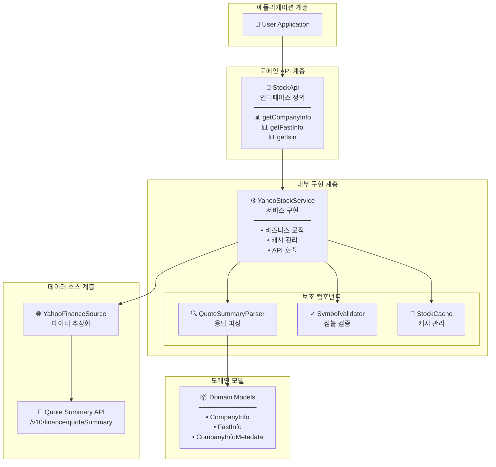
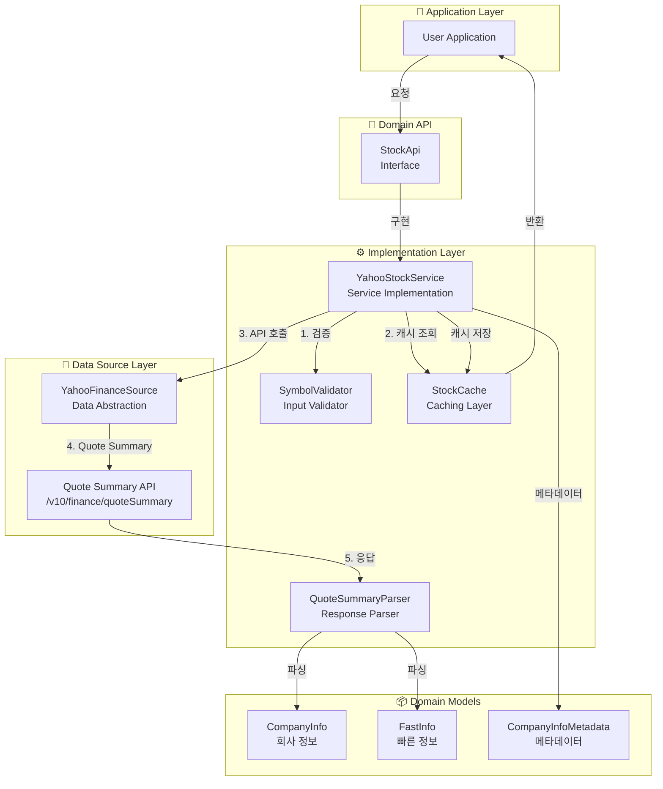
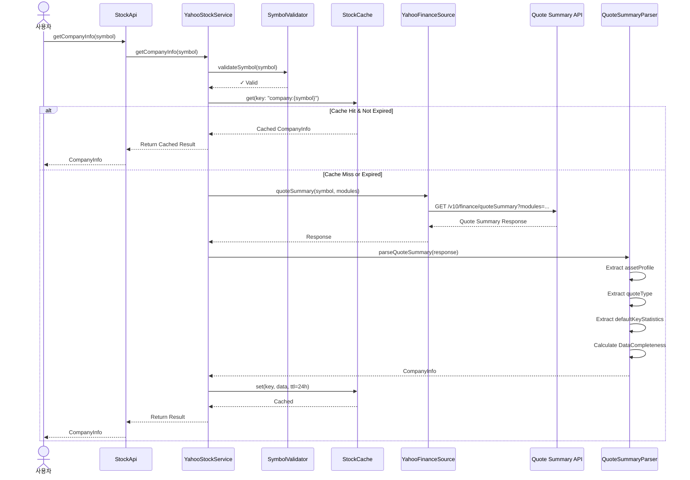

# UFC.STOCK 기술명세서 (Technical Specification)

## 문서 정보
- **버전**: 2.0.0
- **최종 수정일**: 2025-12-03
- **작성자**: Claude Code (Software Architect)
- **문서 상태**: Design Specification
- **문서 유형**: 설계 명세서 (코드 구현 제외)
- **변경 사항**: 네임스페이스 체계에 따라 범위 축소 (v1.0.0 → v2.0.0)

---

## 목차
1. [개요](#1-개요)
2. [Yahoo Finance API 분석](#2-yahoo-finance-api-분석)
3. [API 설계](#3-api-설계)
4. [데이터 모델](#4-데이터-모델)
5. [자산 유형 지원](#5-자산-유형-지원)
6. [TTL 캐싱 전략](#6-ttl-캐싱-전략)
7. [구현 상세](#7-구현-상세)
8. [아키텍처 다이어그램](#8-아키텍처-다이어그램)
9. [테스트 시나리오](#9-테스트-시나리오)

---

## 1. 개요

### 1.1 목적

Stock 도메인은 **회사 기본 정보**만을 담당하는 간결한 서비스입니다.

**핵심 기능:**
- 회사 기본 정보 (Company Info) 조회
- 빠른 정보 조회 (Fast Info)
- ISIN 코드 조회

**제외 대상** (다른 네임스페이스로 분리됨):
- ❌ 주주 정보 → `ufc.holders`
- ❌ 애널리스트 정보 → `ufc.analyst`
- ❌ 뉴스/공시 → `ufc.news`
- ❌ 재무제표 → `ufc.financials`
- ❌ 가격 정보 (marketCap 포함) → `ufc.price`

### 1.2 범위 (네임스페이스 체계 기준)

**담당 데이터:**

| 데이터 | 포함 여부 | 담당 네임스페이스 |
|-------|---------|----------------|
| 회사명, 섹터, 산업 | ✅ | ufc.stock |
| 주소, 웹사이트, 직원수 | ✅ | ufc.stock |
| 사업 개요 (description) | ✅ | ufc.stock |
| ISIN, CUSIP 등 식별자 | ✅ | ufc.stock |
| 발행주식수 (sharesOutstanding) | ✅ | ufc.stock (경계 케이스) |
| 통화, 거래소, 자산 유형 | ✅ | ufc.stock (Fast Info) |
| 시가총액 (marketCap) | ❌ | ufc.price |
| PER, PBR, ROE 등 재무 비율 | ❌ | ufc.financials |
| 배당수익률 (dividendYield) | ❌ | ufc.price |
| 주주 정보 | ❌ | ufc.holders |
| 애널리스트 추천 | ❌ | ufc.analyst |

**경계 케이스 정의:**
- `sharesOutstanding` (발행주식수): **stock**에 포함
  - 이유: 회사 기본 정보, 자주 변경되지 않음
- `marketCap` (시가총액): **price**에 포함
  - 이유: 주가 × 발행주식수로 실시간 변동

### 1.3 데이터 소스

**Yahoo Finance Quote Summary API:**

**엔드포인트:**
```
https://query2.finance.yahoo.com/v10/finance/quoteSummary/{symbol}
```

**사용 모듈:**

| 모듈 | 설명 | 주요 필드 |
|-----|------|---------|
| `assetProfile` | 기업 프로필 | sector, industry, country, website, employees, description |
| `summaryProfile` | 요약 프로필 | address, city, phone, longBusinessSummary |
| `quoteType` | 자산 유형 정보 | symbol, shortName, longName, quoteType, exchange, currency |
| `defaultKeyStatistics` | 주요 통계 | sharesOutstanding |

**인증:**
- Cookie + Crumb 토큰 기반 인증
- YahooFinanceSource의 인증 메커니즘 재사용

### 1.4 yfinance 호환성

**Python yfinance의 기본 정보 관련 기능을 Kotlin으로 이식:**

| yfinance 메서드/속성 | UFC.STOCK 메서드 | 설명 |
|-------------------|-----------------|------|
| `Ticker.info` (일부) | `getCompanyInfo()` | 회사 기본 정보만 (재무/가격 제외) |
| `Ticker.fast_info` | `getFastInfo()` | 빠른 조회용 (currency, exchange, quoteType) |
| `Ticker.isin` | `getIsin()` | ISIN 코드 |
| `Ticker.get_shares()` | `getShares()` | 발행주식수 히스토리 (분기별) |
| `Ticker.get_shares_full()` | `getSharesFull()` | 발행주식수 상세 히스토리 (시작/종료일 지정) |

**주요 차이점:**
- yfinance의 `info`는 매우 광범위 (가격, 재무, 주주 등 모두 포함)
- UFC.STOCK은 **기본 회사 정보만** 제공
- 다른 정보는 해당 네임스페이스 API 사용 필요

### 1.5 기술 스택

| 레이어 | 기술 |
|--------|------|
| **언어** | Kotlin 1.9+ |
| **HTTP Client** | Ktor Client |
| **직렬화** | Kotlinx Serialization |
| **동시성** | Kotlin Coroutines |
| **캐싱** | ConcurrentHashMap (In-Memory) |
| **테스트** | JUnit 5, Kotest, MockK |

---

## 2. Yahoo Finance API 분석

### 2.1 Quote Summary API 구조

**Request:**

```http
GET /v10/finance/quoteSummary/AAPL?modules=assetProfile,summaryProfile,quoteType,defaultKeyStatistics&crumb=xxx HTTP/1.1
Host: query2.finance.yahoo.com
Cookie: A3=xxx
User-Agent: Mozilla/5.0
```

**Response 구조:**

```json
{
  "quoteSummary": {
    "result": [
      {
        "assetProfile": {
          "sector": "Technology",
          "industry": "Consumer Electronics",
          "country": "United States",
          "website": "https://www.apple.com",
          "fullTimeEmployees": 164000,
          "longBusinessSummary": "Apple Inc. designs, manufactures, and markets smartphones...",
          "address1": "One Apple Park Way",
          "city": "Cupertino",
          "state": "CA",
          "zip": "95014",
          "phone": "408 996 1010"
        },
        "summaryProfile": {
          "address1": "One Apple Park Way",
          "city": "Cupertino",
          "state": "CA",
          "zip": "95014",
          "country": "United States",
          "phone": "408 996 1010",
          "website": "https://www.apple.com",
          "industry": "Consumer Electronics",
          "sector": "Technology"
        },
        "quoteType": {
          "symbol": "AAPL",
          "shortName": "Apple Inc.",
          "longName": "Apple Inc.",
          "quoteType": "EQUITY",
          "exchange": "NMS",
          "currency": "USD"
        },
        "defaultKeyStatistics": {
          "sharesOutstanding": 15550061000
        }
      }
    ],
    "error": null
  }
}
```

### 2.2 모듈별 필드 매핑

**assetProfile 모듈:**

| Yahoo API 필드 | UFC 모델 필드 | 타입 | Nullable |
|---------------|-------------|------|----------|
| sector | sector | String | Y |
| industry | industry | String | Y |
| country | country | String | Y |
| website | website | String | Y |
| fullTimeEmployees | employees | Long | Y |
| longBusinessSummary | description | String | Y |
| address1 | address | String | Y |
| city | city | String | Y |
| state | state | String | Y |
| zip | zipCode | String | Y |
| phone | phone | String | Y |

**quoteType 모듈:**

| Yahoo API 필드 | UFC 모델 필드 | 타입 | Nullable |
|---------------|-------------|------|----------|
| symbol | symbol | String | N |
| shortName | shortName | String | Y |
| longName | longName | String | N |
| quoteType | quoteType | AssetType | Y |
| exchange | exchange | String | Y |
| currency | currency | String | Y |

**defaultKeyStatistics 모듈:**

| Yahoo API 필드 | UFC 모델 필드 | 타입 | Nullable |
|---------------|-------------|------|----------|
| sharesOutstanding | sharesOutstanding | Long | Y |

### 2.3 Fast Info API

yfinance의 `fast_info`는 내부적으로 가벼운 API 호출을 사용합니다.

**UFC 구현 전략:**
- `getFastInfo()`는 `quoteType` 모듈만 조회
- 최소한의 필드만 반환 (symbol, exchange, currency, quoteType)
- 캐시 TTL: 24시간

### 2.4 ISIN 조회 API

**yfinance 구현:**
- `quote-equity/v2/get-profile?symbol={symbol}` 엔드포인트 사용
- isin 필드 추출

**UFC 구현 전략:**
- 동일한 엔드포인트 사용
- 또는 `quoteSummary`의 `defaultKeyStatistics` 모듈 활용 (isin 포함 가능)

---

## 3. API 설계

### 3.1 StockApi 인터페이스

```kotlin
/**
 * Stock 도메인 API - 회사 기본 정보 전문
 */
interface StockApi {

    /**
     * 회사 기본 정보 조회 (단일 심볼)
     *
     * @param symbol 심볼 (예: "AAPL", "GOOGL")
     * @return CompanyInfo 회사 기본 정보
     * @throws InvalidSymbolException 심볼 형식 오류
     * @throws StockDataNotFoundException 데이터 없음
     * @throws UFCException 기타 에러
     */
    suspend fun getCompanyInfo(symbol: String): CompanyInfo

    /**
     * 회사 기본 정보 조회 (다중 심볼)
     *
     * @param symbols 심볼 목록 (최대 50개)
     * @return Map<String, CompanyInfo> 심볼별 회사 정보
     */
    suspend fun getCompanyInfo(symbols: List<String>): Map<String, CompanyInfo>

    /**
     * 빠른 정보 조회 (최소한의 필드만)
     *
     * @param symbol 심볼
     * @return FastInfo 빠른 조회용 정보 (currency, exchange, quoteType, symbol)
     * @throws InvalidSymbolException 심볼 형식 오류
     * @throws UFCException 기타 에러
     */
    suspend fun getFastInfo(symbol: String): FastInfo

    /**
     * 빠른 정보 조회 (다중 심볼)
     *
     * @param symbols 심볼 목록 (최대 50개)
     * @return Map<String, FastInfo> 심볼별 빠른 정보
     */
    suspend fun getFastInfo(symbols: List<String>): Map<String, FastInfo>

    /**
     * ISIN 코드 조회
     *
     * @param symbol 심볼
     * @return String ISIN 코드 (예: "US0378331005")
     * @throws InvalidSymbolException 심볼 형식 오류
     * @throws IsinNotFoundException ISIN 데이터 없음
     * @throws UFCException 기타 에러
     */
    suspend fun getIsin(symbol: String): String

    /**
     * ISIN 코드 조회 (다중 심볼)
     *
     * @param symbols 심볼 목록 (최대 50개)
     * @return Map<String, String> 심볼별 ISIN 코드
     */
    suspend fun getIsin(symbols: List<String>): Map<String, String>

    /**
     * Raw Quote Summary 응답 조회 (디버깅/커스텀 파싱용)
     *
     * @param symbol 심볼
     * @param modules Quote Summary 모듈 목록
     * @return QuoteSummaryResponse 원본 응답
     */
    suspend fun getRawQuoteSummary(
        symbol: String,
        modules: List<QuoteSummaryModule> = listOf(
            QuoteSummaryModule.ASSET_PROFILE,
            QuoteSummaryModule.SUMMARY_PROFILE,
            QuoteSummaryModule.QUOTE_TYPE,
            QuoteSummaryModule.DEFAULT_KEY_STATISTICS
        )
    ): QuoteSummaryResponse

    // ========== 발행주식수 히스토리 ==========

    /**
     * 발행주식수 히스토리 조회 (분기별)
     *
     * @param symbol 심볼
     * @return List<SharesData> 분기별 발행주식수 히스토리
     * @throws InvalidSymbolException 심볼 형식 오류
     * @throws SharesDataNotFoundException 데이터 없음
     */
    suspend fun getShares(symbol: String): List<SharesData>

    /**
     * 발행주식수 히스토리 조회 (다중 심볼)
     *
     * @param symbols 심볼 목록 (최대 50개)
     * @return Map<String, List<SharesData>> 심볼별 발행주식수 히스토리
     */
    suspend fun getShares(symbols: List<String>): Map<String, List<SharesData>>

    /**
     * 발행주식수 상세 히스토리 조회 (시작/종료일 지정)
     *
     * @param symbol 심볼
     * @param start 시작일 (null이면 최초 데이터부터)
     * @param end 종료일 (null이면 최신 데이터까지)
     * @return List<SharesData> 기간별 발행주식수 히스토리
     */
    suspend fun getSharesFull(
        symbol: String,
        start: LocalDate? = null,
        end: LocalDate? = null
    ): List<SharesData>
}
```

### 3.2 QuoteSummaryModule 열거형

```kotlin
enum class QuoteSummaryModule(val value: String) {
    ASSET_PROFILE("assetProfile"),
    SUMMARY_PROFILE("summaryProfile"),
    QUOTE_TYPE("quoteType"),
    DEFAULT_KEY_STATISTICS("defaultKeyStatistics");

    companion object {
        fun fromString(value: String): QuoteSummaryModule? {
            return values().firstOrNull { it.value == value }
        }
    }
}
```

### 3.3 AssetType 열거형

```kotlin
enum class AssetType(val value: String) {
    EQUITY("EQUITY"),
    ETF("ETF"),
    MUTUALFUND("MUTUALFUND"),
    INDEX("INDEX"),
    CRYPTOCURRENCY("CRYPTOCURRENCY"),
    CURRENCY("CURRENCY"),
    FUTURE("FUTURE"),
    OPTION("OPTION"),
    UNKNOWN("UNKNOWN");

    companion object {
        fun fromString(value: String?): AssetType {
            return values().firstOrNull { it.value == value } ?: UNKNOWN
        }
    }
}
```

---

## 4. 데이터 모델

### 4.1 CompanyInfo (회사 기본 정보)

**목적:** 회사의 기본 정보 및 식별자 제공

```kotlin
data class CompanyInfo(
    // 기본 식별자
    val symbol: String,
    val longName: String,
    val shortName: String?,

    // 분류 정보
    val sector: String?,
    val industry: String?,
    val country: String?,

    // 거래소 정보
    val exchange: String?,
    val currency: String?,
    val quoteType: AssetType?,

    // 연락처 정보
    val website: String?,
    val phone: String?,
    val address: String?,
    val city: String?,
    val state: String?,
    val zipCode: String?,

    // 기업 정보
    val employees: Long?,
    val description: String?,

    // 발행주식수 (경계 케이스)
    val sharesOutstanding: Long?,

    // 메타데이터
    val metadata: CompanyInfoMetadata
)
```

**필드 설명:**

| 필드 | 타입 | Nullable | 설명 | 검증 규칙 |
|-----|------|----------|------|----------|
| symbol | String | N | 심볼 (예: AAPL) | 유효한 심볼 |
| longName | String | N | 정식 회사명 (예: Apple Inc.) | 비어있지 않음 |
| shortName | String | Y | 짧은 이름 (예: Apple) | - |
| sector | String | Y | 섹터 (예: Technology) | - |
| industry | String | Y | 업종 (예: Consumer Electronics) | - |
| country | String | Y | 국가 (예: United States) | - |
| exchange | String | Y | 거래소 코드 (예: NMS, NYSE) | - |
| currency | String | Y | 통화 코드 (예: USD, KRW) | ISO 4217 |
| quoteType | AssetType | Y | 자산 유형 | EQUITY, ETF, etc. |
| website | String | Y | 웹사이트 URL | 유효한 URL |
| phone | String | Y | 전화번호 | - |
| address | String | Y | 주소 | - |
| city | String | Y | 도시 | - |
| state | String | Y | 주/도 | - |
| zipCode | String | Y | 우편번호 | - |
| employees | Long | Y | 정규직 직원 수 | >= 0 |
| description | String | Y | 사업 개요 | - |
| sharesOutstanding | Long | Y | 발행주식수 | >= 0 |
| metadata | CompanyInfoMetadata | N | 메타데이터 | - |

**특징:**
- 대부분의 필드가 Nullable (데이터 가용성 제한)
- 자산 유형별 가용성 상이:
  - EQUITY: 거의 모든 필드 제공
  - ETF: sector, industry, employees는 보통 null
  - MUTUALFUND: 제한적 정보
  - INDEX: 기본 정보만
- TTL: 24시간 (기본 정보는 자주 변경되지 않음)

**사용 사례:**
- 기업 프로필 조회
- 섹터/업종 필터링
- 연락처 정보 확인
- 사업 개요 확인

### 4.2 FastInfo (빠른 정보)

**목적:** 최소한의 필드만 빠르게 조회

```kotlin
data class FastInfo(
    val symbol: String,
    val currency: String,
    val exchange: String,
    val quoteType: AssetType
)
```

**필드 설명:**

| 필드 | 타입 | Nullable | 설명 |
|-----|------|----------|------|
| symbol | String | N | 심볼 |
| currency | String | N | 통화 코드 (예: USD) |
| exchange | String | N | 거래소 코드 (예: NMS) |
| quoteType | AssetType | N | 자산 유형 |

**특징:**
- 모든 필드 Non-nullable
- 최소한의 API 호출 (quoteType 모듈만)
- yfinance의 `fast_info` 호환
- 응답 시간: < 100ms (추정)

**사용 사례:**
- 심볼 검증
- 통화/거래소 확인
- 자산 유형 확인

### 4.3 SharesData (발행주식수 히스토리)

**목적:** 발행주식수 히스토리 데이터 포인트

```kotlin
data class SharesData(
    val date: LocalDate,
    val shares: Long
)
```

**필드 설명:**

| 필드 | 타입 | Nullable | 설명 |
|-----|------|----------|------|
| date | LocalDate | N | 기준일 (보통 분기말) |
| shares | Long | N | 발행주식수 |

**특징:**
- 분기별 발행주식수 데이터
- `getShares()`: 최근 분기별 데이터 (약 4-8분기)
- `getSharesFull()`: 전체 기간 데이터 (시작/종료일 지정 가능)
- 주식 분할, 자사주 매입 등의 영향 반영

**사용 사례:**
- 발행주식수 추이 분석
- 희석 효과 분석
- 시가총액 변화 추적

**yfinance 호환성:**

| yfinance | UFC | 비고 |
|----------|-----|------|
| `Ticker.get_shares()` | `getShares()` | 최근 분기별 |
| `Ticker.get_shares_full(start, end)` | `getSharesFull(start, end)` | 전체 기간 |

### 4.4 CompanyInfoMetadata (메타데이터)

**목적:** 조회 결과의 메타 정보

```kotlin
data class CompanyInfoMetadata(
    val symbol: String,
    val fetchedAt: Long,                  // Unix timestamp (millis)
    val source: String,                   // "YahooFinance"
    val modulesUsed: List<String>,        // ["assetProfile", "quoteType", ...]
    val dataCompleteness: DataCompleteness
)
```

**DataCompleteness:**

```kotlin
data class DataCompleteness(
    val totalFields: Int,         // 전체 필드 수
    val populatedFields: Int,     // 채워진 필드 수
    val completenessPercent: Double  // populatedFields / totalFields * 100
)
```

**사용 사례:**
- 데이터 품질 평가
- 캐시 유효성 확인
- 디버깅 및 로깅

---

## 5. 자산 유형 지원

### 5.1 자산 유형별 데이터 가용성

| 필드 | EQUITY | ETF | MUTUALFUND | INDEX | CRYPTO |
|-----|--------|-----|------------|-------|--------|
| **symbol** | ✅ | ✅ | ✅ | ✅ | ✅ |
| **longName** | ✅ | ✅ | ✅ | ✅ | ✅ |
| **shortName** | ✅ | ✅ | ✅ | ✅ | ✅ |
| **sector** | ✅ | ⚠️ | ❌ | ❌ | ❌ |
| **industry** | ✅ | ⚠️ | ❌ | ❌ | ❌ |
| **country** | ✅ | ⚠️ | ⚠️ | ❌ | ❌ |
| **exchange** | ✅ | ✅ | ✅ | ✅ | ✅ |
| **currency** | ✅ | ✅ | ✅ | ✅ | ✅ |
| **quoteType** | ✅ | ✅ | ✅ | ✅ | ✅ |
| **website** | ✅ | ⚠️ | ⚠️ | ❌ | ⚠️ |
| **phone** | ✅ | ❌ | ❌ | ❌ | ❌ |
| **address** | ✅ | ❌ | ❌ | ❌ | ❌ |
| **employees** | ✅ | ❌ | ❌ | ❌ | ❌ |
| **description** | ✅ | ⚠️ | ⚠️ | ❌ | ⚠️ |
| **sharesOutstanding** | ✅ | ✅ | ✅ | ❌ | ⚠️ |

**범례:**
- ✅ 완전 지원 (항상 제공)
- ⚠️ 부분 지원 (일부만 제공, 또는 자주 null)
- ❌ 미지원 (거의 항상 null)

### 5.2 자산 유형별 처리 전략

**EQUITY (주식):**
- 거의 모든 필드 제공
- 완전한 assetProfile 데이터
- TTL: 24시간

**ETF (상장지수펀드):**
- 기본 정보만 제공 (sector, industry 종종 null)
- description은 펀드 설명으로 제공
- TTL: 24시간

**MUTUALFUND (뮤추얼펀드):**
- 제한적 정보 (symbol, name, exchange, currency)
- sector, industry, employees 거의 없음
- TTL: 24시간

**INDEX (지수):**
- 최소한의 정보 (symbol, name, exchange)
- assetProfile 모듈 없음
- TTL: 24시간

**CRYPTOCURRENCY:**
- 기본 정보만 (symbol, name, exchange, currency)
- 전통적 기업 정보 없음
- TTL: 24시간

### 5.3 데이터 완전성 처리

**Nullable 필드 처리:**
- 모든 선택적 필드는 Nullable로 정의
- null 값은 정상 처리 (에러 아님)
- DataCompleteness로 데이터 품질 표시

**부분 성공 처리:**
- 일부 모듈만 성공 시에도 결과 반환
- 실패한 모듈의 필드는 null
- metadata.modulesUsed로 사용된 모듈 표시

---

## 6. TTL 캐싱 전략

### 6.1 캐시 정책

| 데이터 타입 | Cache Key | TTL | 이유 |
|-----------|----------|-----|------|
| CompanyInfo | `company:{symbol}` | 24시간 | 기본 정보는 자주 변경 안됨 |
| FastInfo | `fastinfo:{symbol}` | 24시간 | 거래소/통화 정보 변경 거의 없음 |
| Isin | `isin:{symbol}` | 영구 | ISIN은 변경 안됨 |

**캐시 키 구조:**
```
company:{symbol}
fastinfo:{symbol}
isin:{symbol}

예시:
- company:AAPL
- fastinfo:GOOGL
- isin:MSFT
```

### 6.2 캐시 크기 제한

**제한:**
- 최대 1000개 심볼
- LRU (Least Recently Used) 정책

**메모리 추정:**
- 1개 CompanyInfo: ~2KB (평균)
- 1000개: ~2MB
- 충분히 작은 크기

### 6.3 캐시 무효화

**자동 무효화:**
- TTL 만료 시: 자동 삭제
- 서비스 재시작 시: 캐시 초기화 (In-Memory)

**수동 무효화:**
- API 미제공
- 필요 시: 서비스 재시작

---

## 7. 구현 상세

### 7.1 YahooStockService (내부 구현)

```kotlin
internal class YahooStockService(
    private val httpClient: HttpClient,
    private val rateLimiter: RateLimiter,
    private val authResult: AuthResult
) : StockApi {

    // 캐시
    private val companyInfoCache = ConcurrentHashMap<String, CachedCompanyInfo>()
    private val fastInfoCache = ConcurrentHashMap<String, CachedFastInfo>()
    private val isinCache = ConcurrentHashMap<String, String>()

    // TTL 설정
    companion object {
        const val COMPANY_INFO_TTL_MILLIS = 86_400_000L  // 24시간
        const val MAX_CONCURRENT_REQUESTS = 10
        const val MAX_BATCH_SIZE = 50
    }

    // Public API 구현
    override suspend fun getCompanyInfo(symbol: String): CompanyInfo
    override suspend fun getCompanyInfo(symbols: List<String>): Map<String, CompanyInfo>
    override suspend fun getFastInfo(symbol: String): FastInfo
    override suspend fun getFastInfo(symbols: List<String>): Map<String, FastInfo>
    override suspend fun getIsin(symbol: String): String
    override suspend fun getIsin(symbols: List<String>): Map<String, String>
    override suspend fun getRawQuoteSummary(symbol: String, modules: List<QuoteSummaryModule>): QuoteSummaryResponse

    // Private 헬퍼 메서드
    private suspend fun fetchQuoteSummary(symbol: String, modules: List<QuoteSummaryModule>): QuoteSummaryResponse
    private fun parseCompanyInfo(response: QuoteSummaryResponse): CompanyInfo
    private fun parseFastInfo(response: QuoteSummaryResponse): FastInfo
    private fun parseIsin(response: QuoteSummaryResponse): String
    private fun validateSymbol(symbol: String)
    private fun generateCacheKey(prefix: String, symbol: String): String
}
```

### 7.2 데이터 처리 흐름

**getCompanyInfo() 흐름:**

```
User Request: getCompanyInfo("AAPL")
    ↓
[1] 입력 검증
    - 심볼 형식 검증
    ↓
[2] 캐시 조회
    - Key: "company:AAPL"
    ↓
    ├─> Cache Hit && Not Expired
    │   → CompanyInfo 반환
    │
    └─> Cache Miss || Expired
         ↓
        [3] Rate Limiter 토큰 획득
            ↓
        [4] Quote Summary API 호출
            - modules: assetProfile, summaryProfile, quoteType, defaultKeyStatistics
            ↓
        [5] 응답 검증
            - HTTP 상태 확인 (200 OK)
            - quoteSummary.error 필드 확인
            ↓
        [6] 응답 파싱
            - parseCompanyInfo(response)
            - 각 모듈에서 필드 추출
            - Nullable 필드 처리
            ↓
        [7] 메타데이터 생성
            - DataCompleteness 계산
            ↓
        [8] 캐시 저장
            - TTL: 24시간
            ↓
        [9] CompanyInfo 반환
```

**getFastInfo() 흐름:**

```
User Request: getFastInfo("AAPL")
    ↓
[1] 입력 검증
    ↓
[2] 캐시 조회 ("fastinfo:AAPL")
    ↓
    ├─> Cache Hit → 반환
    │
    └─> Cache Miss
         ↓
        [3] Quote Summary API 호출
            - modules: quoteType (단일 모듈)
            ↓
        [4] parseFastInfo(response)
            - symbol, currency, exchange, quoteType 추출
            ↓
        [5] 캐시 저장 (TTL: 24시간)
            ↓
        [6] FastInfo 반환
```

### 7.3 배치 조회 최적화

**병렬 처리:**
- 최대 동시 실행: 10개 (MAX_CONCURRENT_REQUESTS)
- Semaphore(10) 사용
- 캐시 Hit 심볼: API 호출 생략

**에러 처리:**
- 개별 심볼 실패: 로그 기록 + Map에서 제외
- 부분 성공: 성공한 심볼만 반환

---

## 8. 아키텍처 다이어그램

### 8.1 레이어 구조



### 8.2 컴포넌트 다이어그램



### 8.3 시퀀스 다이어그램



---

## 9. 테스트 시나리오

### 9.1 Unit Test 시나리오

**파싱 로직 테스트:**
- Quote Summary 응답 파싱 정확성
- Nullable 필드 처리
- 부분 성공 처리 (일부 모듈만 성공)
- DataCompleteness 계산

**캐싱 테스트:**
- TTL 내에서 캐시 데이터 반환
- TTL 초과 후 API 재호출
- LRU 정책 적용 (1000개 초과 시)

**입력 검증 테스트:**
- 유효한 심볼 처리
- 유효하지 않은 심볼 거부
- 배치 크기 제한 (최대 50개)

### 9.2 자산 유형별 테스트 시나리오

**EQUITY (주식) 테스트:**
- 픽스쳐: AAPL (Apple)
- 예상: 모든 필드 제공
- DataCompleteness: > 90%

**ETF 테스트:**
- 픽스쳐: SPY (S&P 500 ETF)
- 예상: sector, industry는 null 가능
- DataCompleteness: 60-80%

**MUTUALFUND 테스트:**
- 픽스쳐: VTSAX (Vanguard Total Stock Market Fund)
- 예상: 제한적 정보
- DataCompleteness: 40-60%

**INDEX 테스트:**
- 픽스쳐: ^GSPC (S&P 500 Index)
- 예상: 최소한의 정보
- DataCompleteness: 30-50%

**CRYPTOCURRENCY 테스트:**
- 픽스쳐: BTC-USD (Bitcoin)
- 예상: 기본 정보만
- DataCompleteness: 30-40%

### 9.3 배치 조회 테스트 시나리오

**정상 배치 조회:**
- 입력: ["AAPL", "GOOGL", "MSFT"]
- 예상: 3개 모두 성공

**부분 실패 처리:**
- 입력: ["AAPL", "INVALID", "GOOGL"]
- 예상: AAPL, GOOGL만 Map에 포함

**캐시 효율성:**
- 첫 조회: 3개 API 호출
- 재조회: 0개 API 호출 (캐시)

### 9.4 에러 처리 테스트 시나리오

**심볼 없음 (404):**
- 입력: "INVALID123"
- 예상: StockDataNotFoundException

**인증 실패 (401):**
- 예상: AuthFailedException
- 재인증 필요

**Rate Limit (429):**
- 예상: Exponential Backoff 재시도
- 최대 3회 시도

### 9.5 Live Test 시나리오

**실제 API 통합 테스트:**
- 실제 Yahoo Finance API 호출
- 응답 파싱 정확성 검증
- 자동 녹화 및 재생

**테스트 픽스쳐:**

| Symbol | 타입 | 목적 |
|--------|------|------|
| AAPL | EQUITY | 완전한 데이터 |
| SPY | ETF | 제한적 데이터 |
| VTSAX | MUTUALFUND | 최소한의 데이터 |
| ^GSPC | INDEX | 기본 정보만 |
| BTC-USD | CRYPTO | 암호화폐 |

### 9.6 성능 테스트 시나리오

**목표:**
- 단일 조회: < 200ms (캐시 Miss)
- 단일 조회: < 10ms (캐시 Hit)
- 배치 조회 (50개): < 5초 (캐시 Miss)
- 배치 조회 (50개): < 100ms (캐시 Hit)

---

## 파일 구조

```
src/main/kotlin/com/ulalax/ufc/
├── api/
│   └── StockApi.kt                     # Stock 도메인 인터페이스
│
├── internal/stock/
│   └── YahooStockService.kt            # 서비스 구현체
│
├── model/stock/
│   ├── CompanyInfo.kt                  # 회사 정보 모델
│   ├── FastInfo.kt                     # 빠른 정보 모델
│   ├── CompanyInfoMetadata.kt          # 메타데이터
│   ├── DataCompleteness.kt             # 데이터 완전성
│   └── AssetType.kt                    # 자산 유형 열거형
│
├── internal/yahoo/response/
│   └── QuoteSummaryResponse.kt         # Quote Summary 응답 (기존 재사용)
│
└── exception/
    ├── UFCException.kt
    ├── ErrorCode.kt
    └── StockExceptions.kt              # 커스텀 예외
        ├── StockDataNotFoundException
        └── IsinNotFoundException
```

---

## 참고 자료

- **Python yfinance**: https://github.com/ranaroussi/yfinance
- **UFC 네임스페이스 체계**: `/plan/2차개발/ufc-네임스페이스-체계.md`
- **금융 데이터 네임스페이스 표준**: `/plan/2차개발/금융데이터-네임스페이스-표준.md`
- **UFC.CORP 기술명세서**: `/plan/2차개발/ufc.corp-기술명세서.md`
- **UFC.PRICE 기술명세서**: `/plan/2차개발/ufc.price-기술명세서.md`

---

**최종 수정일**: 2025-12-03
**문서 버전**: 2.0.0
**문서 유형**: 설계 명세서 (코드 구현 제외)
**변경 이력**:
- v1.0.0: 초기 버전 (광범위한 범위 - 주주, 애널리스트, 뉴스 등 포함)
- v2.0.0: 네임스페이스 체계에 따라 기본 회사 정보만으로 축소
